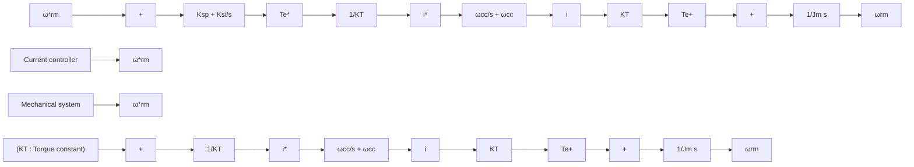
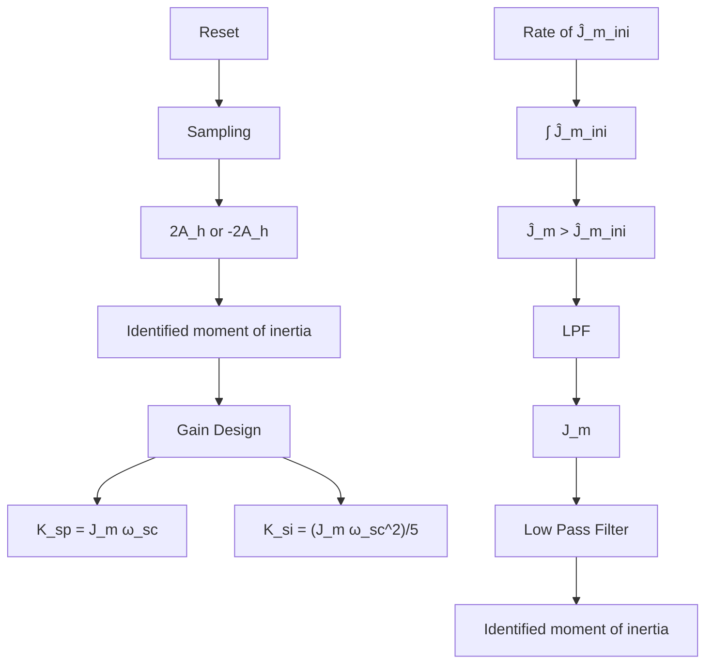
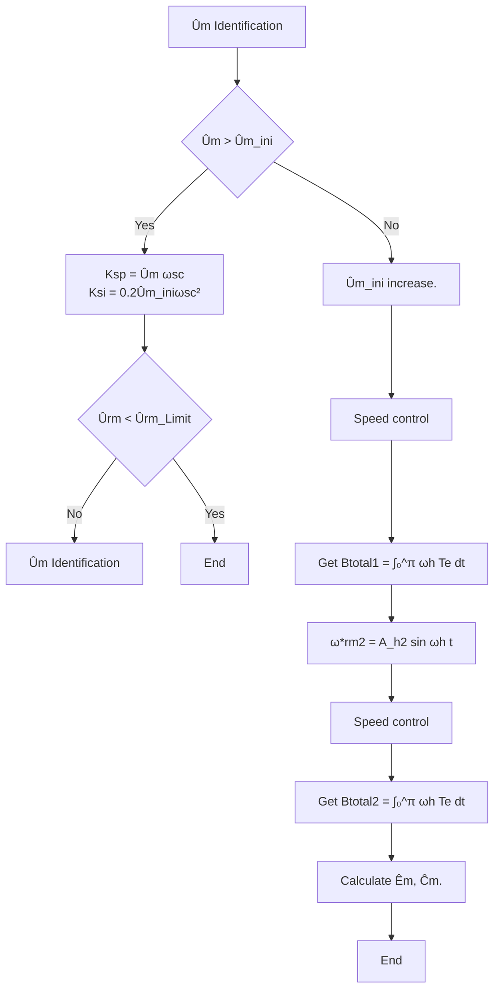
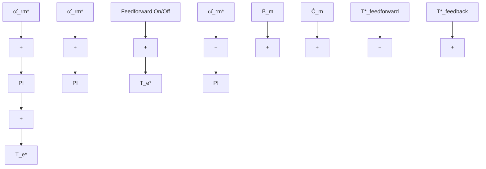

# Moment of Inertia and Friction Torque Coefficient Identification in a Servo Drive System

Sungmin Kim , Member, IEEE

Abstract—This paper proposes a new method to identify the mechanical parameters of a servo drive system, such as the moment of inertia and friction torque coefficients. Identification of the moment of inertia is essential for the design of a high-performance speed and position controller. Furthermore, the mechanical friction torque coefficients, such as the viscous and Coulomb friction torque coefficients, can be used to reduce the speed and position error without resorting to the use of a high gain for the speed controller. To simultaneously identify the moment of inertia and the friction torque coefficients, the proposed method uses the fact that the sinusoidal speed is in phase with the friction torque and out of phase with the torque for the moment of inertia. The proposed method is based on the speed control loop and the moment of inertia, and friction torque coefficients can be exactly obtained from a half-period integration of the torque reference of the low frequency sinusoidal speed control. Using computer simulations and experiments employing 600-W servo drive systems, the feasibility of the proposed method was verified.

Index Terms—Coulomb friction torque coefficient, mechanical parameter identification, moment of inertia, friction torque coefficient, viscous friction torque coefficient.

## I. INTRODUCTION

W ITH the increase in industrial automation, servo drivesystems have become increasingly popular. Servo drive systems have become the fundamental technology for accomplishing automation not only in industrial systems, but also in home applications. Currently, the Fourth Industrial Revolution requires an extremely high quality control of the servo drive system for high-level system operations. The position and the speed control performance of the servo drive system are critical.

To improve the performance of position and speed control, it is essential to know the mechanical system parameters, such as the moment of inertia and friction torque coefficients. The moment of inertia is an important parameter for two reasons: it Manuscript received October 23, 2017; revised January 30, 2018 and March 29, 2018; accepted March 31, 2018. Date of publication April 12, 2018; date of current version August 31, 2018. This work was supported by the New & Renewable Energy Core Technology Program of the Korea Institute of Energy Technology Evaluation and Planning (KETEP) granted financial resource from the Ministry of Trade, Industry & Energy, Republic of Korea under Grant 20163030031830.

The author is with the Division of Electrical Engineering, Hanyang University, ERICA Campus, Ansan 15588, South Korea (e-mail: ksminmoon @gmail.com).

Color versions of one or more of the figures in this paper are available online at http://ieeexplore.ieee.org.

Digital Object Identifier 10.1109/TIE.2018.2826456

allows instantaneous speed estimation [1], [2] and allows for the gain design of the linear position and speed controller [3]. Since the speed calculated from the incremental encoder is not an instantaneous speed, but an average speed, it produces a speed lag during low-speed operation, and this degrades the speed control performance. To remedy this, speed estimation methods using observer theory have been researched and it has been found that the speed estimation performance using observers is better than that of the speed calculated directly from the encoder pulses [4]. Speed observers are designed from the mechanical system model, and the most critical parameter involving the speed observer is the moment of inertia.

By means of a speed controller, the linear control structure known as the proportional–integral (PI) controller is widely employed. The linear speed controller is simple and has good performance when given the exact mechanical system parameters. In most cases, however, the servo drive systems are connected with transmission devices, such as harmonic gears and screws, under a diverse set of applications. Thus, servo drive systems have faced a variety of nonlinearities with unexpected disturbances, including mechanical parameter variations and friction torque. These disturbances degrade the performance of the speed controller [5], [6].

It is thus required that general purpose servo drive systems cope with the important unknown mechanical system parameters, such as the moment of inertia and the friction torque coefficients. To overcome disturbances in the speed control, various nonlinear speed control schemes have been investigated: adaptive control [7]–[12], robust control [13], sliding-mode control [14], [15], feedforward control [16], and the variable gain controller scheme [17]. These methods adjust the gains and/or variables of controller. To do so, most of these approaches have developed their own estimation algorithms to identify the moment of inertia and/or the friction torque. Similarly, disturbance observers could compensate for the unknown disturbance torque and the mechanical parameters could be identified in the process of the disturbance compensation [1], [2], [4], [18]. Disturbance observers have been proposed with an assumption that the dynamics of the disturbance are slow compared with the bandwidth of their observer. Since the dynamics of the friction torque is proportional to the speed, however, estimation of the friction torque is very difficult. If the bandwidth of the disturbance observer and/or speed controller can be designed to be high, the disturbance may be rejected. However, there are many applications in which the control gains should be low because of the resonant characteristics of the mechanical system.

Another approach to overcome the uncertainties of the moment of inertia and the friction torque is to identify the mechanical parameters during the system commissioning process. In general, the system commissioning process should be conducted after the servo drive system is equipped into the application system. In this process, the information that is required for the servo drive system can be obtained through very limited operations [19]–[22]. In [19], various friction torque models were investigated, and the measurement procedures were proposed through use of the ramp torque input. However, this parameter identification was done from the numerical analysis of the stored speed and torque data, and it is quite difficult to apply it to the commissioning process. In [20], the moment of inertia could be simply identified through the sinusoidal position control. However, the friction torque was not considered. A method for the identification of the moment of inertia and the friction torque coefficients was proposed in [22]. In [22], from three different constant speeds, the friction torque coefficients could be obtained, and from a biased sinusoidal speed, the moment of inertia could be calculated. In numerous cases, such as robots, constant speed operation could be restricted in the commissioning process for safety reasons. Moreover, according to the frequency of sinusoidal speed reference, the identified moment of inertia could be unstable. In [23], the importance of the torque constant for the mechanical parameter has been highlighted. Based on well identified PM flux linkage, the mechanical parameters showed higher accuracy. In [24], sinusoidal torque disturbance was applied to identify the moment of inertia and the viscous friction torque coefficient. The identification method in [24] calculated the parameters with the torque measured at zero speed instance. In this paper, the Coulomb friction torque was not considered. Moreover, several control theories have been applied to identify the mechanical parameters [25], [26].

This paper proposes a new method to identify not only the moment of inertia but also the viscous and Coulomb friction torque coefficients, simultaneously. The proposed method uses the fact that the sinusoidal speed is in phase with the friction torque and out of phase with the inertia torque. The moment of inertia and friction torque coefficients can be exactly obtained from a half-period integration of the torque reference in the very low frequency sinusoidal speed control regime. Since the algorithm is based on the sinusoidal speed operation, it can be employed in the commissioning process. Since the frequency of the sinusoidal reference is very low, the initial control gains are not critical. Also, this paper introduces how to determine the speed control gains and represent the way to decide the initial moment of inertia in practice.

This paper is organized as follows. Section II presents the mechanical system model with the viscous and Coulomb friction torque. To show the effectiveness of the model, the friction torque was obtained using a laboratory experimental setup, and the friction torque found by the model is compared with the experimental results. Section III introduces the principle of the proposed identification method. In Section IV, the implementation of the proposed method is explained. Section V presents the experimental results and demonstrates the effectiveness of the identified moment of inertia and friction torque coefficients. Section VI concludes this paper.

Fig. 1. Friction torque model. (a) Viscous friction torque model. (b) Coulomb friction torque model. (c) Total friction torque model.   

text_image

Coupling
600W
PMSM
Load
Machine

text_image

Current Sensors
Inverter
(2 Sets)
Rectifier
DSP Based
Controller

Fig. 2. 600-W laboratory experimental servo drive system. (a) Servo drive experimental setup. (b) Inverter and controller.

## II. MECHANICAL SYSTEM MODEL INCLUDING FRICTION TORQUE

The following equation describes the mechanical system model, including the friction torque of the servo drive system:

\[
T _ {e} = J _ {m} \frac {d \omega_ {r m}}{d t} + B _ {m} \omega_ {r m} + \operatorname{sign} \left(\omega_ {r m}\right) C _ {m} + T _ {L} \tag {1}
\]

where \(T _ { e } , T _ { L }\) , and \(\omega _ { r m }\) are the torque generated by the servo motor, the load torque, and mechanical speed, respectively, and \(J _ { m } , B _ { m }\) , and \(C _ { m }\) are the moment of inertia, viscous friction torque coefficient, and Coulomb friction torque coefficient, respectively. The viscous friction torque can be represented as a value proportional to the rotating speed. The Coulomb friction torque is not dependent on the rotating speed, but depends on the rotation direction, as shown in Fig. 1. In this paper, the torque required by the moment of inertia is called the inertia torque \(T _ { \mathrm { i n e r t i a } }\) in (2), and the torque caused by the friction is the friction torque \(T _ { \mathrm { f r i c t i o n } } ,\) given in (3). The overall torque in the drive system consists of the inertia torque, the friction torque, and the load torque, given in (4)

\[
T _ {\text { inertia }} = J _ {m} \frac {d \omega_ {r m}}{d t} \tag {2}
\]

\[
T _ {\text { friction }} = B _ {m} \omega_ {r m} + \operatorname{sign} \left(\omega_ {r m}\right) C _ {m} \tag {3}
\]

\[
T _ {e} = T _ {\text { inertia }} + T _ {\text { friction }} + T _ {L}. \tag {4}
\]

To demonstrate the effectiveness of the mechanical system model including the friction torque in (1), the friction torque was measured by the laboratory experimental servo drive system, shown in Fig. 2. The experimental setup consists of a 600-W permanent magnet synchronous machine, an inverter, and a high-performance DSP-based controller. This servo drive system has an incremental encoder which produces 8192 pulses per revolution. To test the servo drive system in various conditions, the servo motor is connected to another permanent magnet synchronous machine, which serves as the load machine. This load machine is also controlled by the inverter and the highperformance DSP-based controller. The moments of inertia of the target servo motor and the load machine are 0.000026 and 0.000093 kg m2, respectively. An interface coupling connects the servo motor and the load machine. The total inertia of the experimental setup, including the interface coupling is about 0.00018 kg·m2.

截距等效为库仑摩擦系数，斜率等效为粘滞摩擦系数但0速附近应该是一个巨大的静摩擦峰值  

line

| Speed [r/min] | Torque [Nm] |
| ------------- | ----------- |
| -3000         | -0.12       |
| -2500         | -0.11       |
| -2000         | -0.10       |
| -1500         | -0.09       |
| -1000         | -0.08       |
| -500          | -0.06       |
| 0             | 0.05        |
| 500           | 0.07        |
| 1000          | 0.09        |
| 1500          | 0.11        |
| 2000          | 0.12        |
| 2500          | 0.13        |
| 3000          | 0.14        |

Fig. 3. Measurement of the friction torque on the 600-W servo drive system.

To measure the friction torque of the laboratory 600-W servo drive system, the servo machine was controlled in speed control mode. To check only the friction torque, the load machine was not controlled. Therefore, the load machine was the only source of system inertia, as well as the source of some friction torque. In the no-load condition, the servo drive system controls the servo motor, running in the constant speed mode. The tests were done at several reference speeds from –3000 to 3000 r/min. In the specific constant speed control condition, the torque references of the servo drive system were measured. Because there was no load torque, the torque reference of the servo drive system can be assigned to the friction torque at a constant speed. The measured torque values at each constant speed condition are depicted in Fig. 3.

The lowest reference speeds were –50 and 50 r/min, and the required torque to control the servo motor at these reference speeds were –0.0476 and 0.0476 N m, respectively. These torque values are assumed to be the Coulomb friction torque. With an increase in the rotating speed, the required torque to drive the mechanical system increased in response. The proportion of the torque increasing according to the speed is assumed to be the viscous friction torque.

To specify the Coulomb friction torque coefficient and the viscous friction torque coefficient from the measured friction torque values, the trend lines of the torque over speeds ranging from 50 to 3000 r/min are shown in Fig. 4. From the trend lines, the Coulomb friction torque coefficient was assumed as 0.0472 N m. The slope of the trend line from 50 to 1000 r/min was 0.000363 N m s, and the slope of the trend line from 50 to 3000 r/min was 0.000272 N m s. Therefore, the viscous friction torque coefficient could be assumed to range from 0.000237 to 0.000363 N m s.

To verify the effectiveness of the mechanical system equation, including the friction torque, given by (1), simulation and experimental results are compared. The mechanical parameters of the laboratory 600-W servo drive system are used in the simulation, and the values of the parameters are listed in Table I. In the no-load condition, the required torque to control the servo motor consists of the inertia torque in (2) and the friction torque in (3). When the rotating speed is sinusoidal following (5), the inertia torque and the friction torque can be derived as (6) and (7), respectively

line

| Speed:Wrm [rad/s] | Torque [Nm] |
| ----------------- | ----------- |
| 0                 | 0.05        |
| 50                | 0.07        |
| 100               | 0.09        |
| 150               | 0.10        |
| 200               | 0.11        |
| 250               | 0.12        |
| 300               | 0.13        |
| 350               | 0.14        |

50rpm应该处在stribeck曲线的跌落区，测出来为滚动摩擦   
Fig. 4. Trend lines of the friction torque values from a speed from 50 to 3000 r/min.

TABLE I PARAMETERS OF MECHANICAL SYSTEM 

<table><tr><td>Parameter</td><td>Value</td></tr><tr><td>Moment of inertia,  \(J_{m}\) </td><td>0.00018 kg·m2</td></tr><tr><td>Viscous friction torque coefficient,  \(B_{m}\) (Varying according to the speed)</td><td>0.000237 N·m·s~ 0.000363 N·m·s</td></tr><tr><td>Coulomb friction torque coefficient,  \(C_{m}\) </td><td>0.0472 N·m</td></tr></table>

line

| Time [s] | speed [Wrpm/r/min] | Torque [Nm] (Te) | Torque [Nm] (T_inertia) | Torque [Nm] (T_friction) |
| -------- | ------------------ | ---------------- | ----------------------- | ------------------------ |
| 0        | 0                  | 0.1              | 0.05                    | 0.0                      |
| 1        | -1000              | -0.1             | -0.05                   | -0.05                    |
| 2        | 1000               | 0.1              | 0.05                    | 0.0                      |
| 3        | -1000              | -0.1             | -0.05                   | -0.05                    |
| 4        | 1000               | 0.1              | 0.05                    | 0.0                      |
| 5        | -1000              | -0.1             | -0.05                   | -0.05                    |
| 6        | 0                  | 0                | 0                       | 0                        |

Fig. 5. Ideal torque composition for sinusoidal rotating speed.

\[
\omega_ {r m} = A _ {h} \sin \omega_ {h} t \tag {5}
\]

\[
T _ {\text { inertia }} = J _ {m} \omega_ {h} \mathrm{A} _ {h} \cos \omega_ {h} t \tag {6}
\]

\[
T _ {\text { friction }} = B _ {m} A _ {h} \sin \omega_ {h} t + \text { sign } (\sin \omega_ {h} t) C _ {m}. \tag {7}
\]

In the sinusoidal speed operation, the inertia torque is sinusoidal and leads the sinusoidal speed by 90°. The friction torque consists of the viscous and the Coulomb friction torque. The friction torque is not exactly sinusoidal because of the nonlinear coulomb friction torque. However, the friction torque is in phase with the sinusoidal speed. The ideal torque composition for sinusoidal rotating speed is illustrated in Fig. 5.

To compare the ideal torque in the simulation with the real torque given by experimental results, the sinusoidal speed control of the 600-W servo drive system was tested. The reference speed was 1000 r/min sinusoidal wave with a 0.5 Hz frequency. Fig. 6 shows the comparison of the torque in the ideal mechanical model and that in the experimental system. In Fig. 6(a) and (b), the total torque \(T _ { e }\) and the inertia torque \(T _ { \mathrm { i n e r t i a } }\) are shown for the 0.5 Hz, 1000 r/min sinusoidal speed condition. Fig. 6(a) is the torque in the ideal mechanical model from the simulation and Fig. 6(b) is the torque given by the experimental result. The total torque and the inertia torque waveforms of the simulation and experimental results are very similar. Even though the total torque in the simulation and the experimental results are not sinusoidal, the inertia torque in the simulation and the experimental results are sinusoidal. That means the friction torque is well compensated for and the measured friction torque coefficient is exact.

line

| Time (s) | Wrpm(r/min) |
| -------- | ----------- |
| 0        | 0           |
| 1        | 1200        |
| 2        | -1200       |
| 3        | 1200        |
| 4        | -1200       |
| 5        | 1200        |
| 6        | -1200       |
| 7        | 1200        |
| 8        | -1200       |
| 9        | 1200        |
| 10       | 0           |

line

| Time[s] | Total torque | Torque for Jm |
| ------- | ------------ | ------------- |
| 0       | 0.1          | 0.1           |
| 1       | -0.1         | -0.1          |
| 2       | 0.1          | 0.1           |
| 3       | -0.1         | -0.1          |
| 4       | 0.1          | 0.1           |
| 5       | -0.1         | -0.1          |
| 6       | 0.1          | 0.1           |
| 7       | -0.1         | -0.1          |
| 8       | 0.1          | 0.1           |
| 9       | -0.1         | -0.1          |
| 10      | 0.1          | 0.1           |

line

| Time (r) | Wrpm [r/min] |
| -------- | ------------ |
| 0        | 0            |
| 1        | 1200         |
| 2        | -1200        |
| 3        | 1200         |
| 4        | -1200        |
| 5        | 1200         |
| 6        | -1200        |
| 7        | 1200         |
| 8        | -1200        |
| 9        | 1200         |
| 10       | 0            |

line

| Time[s] | Torque [Nm] (Blue) | Torque [Nm] (Green) |
| ------- | ------------------ | ------------------- |
| 0       | 0.2                | 0.1                 |
| 1       | -0.1               | -0.1                |
| 2       | 0.1                | 0.0                 |
| 3       | -0.1               | -0.1                |
| 4       | 0.2                | 0.1                 |
| 5       | -0.1               | -0.1                |
| 6       | 0.1                | 0.0                 |
| 7       | -0.1               | -0.1                |
| 8       | 0.2                | 0.1                 |
| 9       | -0.1               | -0.1                |
| 10      | 0.1                | 0.0                 |

(b)   
Fig. 6. Ideal and experimental torque comparison for 0.5 Hz 1000 r/min sinusoidal speed. (a) Ideal torque. (b) Real torque.

## III. IDENTIFICATION OF THE MOMENT OF INERTIA AND THE FRICTION TORQUE COEFFICIENTS

To identify the moment of inertia and the friction torque coefficients, the inertia torque \(T _ { \mathrm { i n e r t i a } }\) and the friction torque \(T _ { \mathrm { f r i c t i o n } }\) must be obtained from the total torque \(T _ { e }\) . Generally, the information of the torque generated by the servo motor can be obtained from the torque reference, which is the output of the speed controller. However, the torque reference of the speed controller in itself cannot be simply divided into the inertia torque and the friction torque. Moreover, when the load torque is not zero, it is very difficult to extract the inertia torque and the friction torque from the torque reference including the load torque.

This paper would cope with this problem for extracting the inertia torque and the friction torque from the total torque independently. For that, this paper has proposed the new identification method with the assumption of the no-load condition. The proposed method has used the torque response when sinusoidal speed operation of servo drive system.

General applications in which the proposed algorithm could be applied are the robot industry, such as SCARA robot. The servo drive system of SCARA robot need to be commissioned before operation. For commissioning, simple movement of the robots would be allowed and this test movement could be used for the parameter identification. In most cases, commission has the no-load or the constant load condition. Through commissioning, the servo drive systems have identified the mechanical parameters.

To distinguish the inertia torque and the friction torque from the total torque independently in the no-load condition, a halfperiod torque integration method in the sinusoidal speed control condition is proposed. The proposed method depends on this mechanical model, which consists of the inertia torque and the friction torque. When the speed is sinusoidal, the inertia torque would be out of phase of the speed and the friction torque would be in phase of the speed. Based on these characteristics, a half-period integration of the torque reference could remove the friction torque or the inertia torque from the total torque according to the integration period. To explain this fundamental principle of the proposed method, Fig. 7 has been illustrated using a simulation waveform. Fig. 7 shows the integration of the torque reference for the specific period. When the sinusoidal speed is expressed in (5), the integral of the torque reference from –0.5π to 0.5π is depicted in Fig. 7(a). In the no-load condition, the torque reference is the sum of the inertia torque and the friction torque. Therefore, the integral of the torque reference is the sum of the integral of the inertia torque and that of the friction torque, shown in (8). Because the friction torque is in phase with the sinusoidal speed, as shown in Fig. 7(a), the integral of the friction torque over the angle of the speed from –0.5π to 0.5π is zero, as in (9). Therefore, the integral of the torque reference is same as that of the torque for the moment of inertia

\[
\int_ {- 0. 5 \pi} ^ {0. 5 \pi} T _ {e} d \theta = \int_ {- \frac {0 . 5 \pi}{\omega_ {h}}} ^ {\frac {0 . 5 \pi}{\omega_ {h}}} T _ {e} d t = \int_ {- \frac {0 . 5 \pi}{\omega_ {h}}} ^ {\frac {0 . 5 \pi}{\omega_ {h}}} T _ {\text { inertia }} d t
\]

\[
+ \int_ {- \frac {0 . 5 \pi}{\omega_ {h}}} ^ {\frac {0 . 5 \pi}{\omega_ {h}}} T _ {\text { friction }} d t \tag {8}
\]

\[
\int_ {- \frac {0 . 5 \pi}{\omega_ {h}}} ^ {\frac {0 . 5 \pi}{\omega_ {h}}} T _ {\text { friction }} d t = \int_ {- \frac {0 . 5 \pi}{\omega_ {h}}} ^ {\frac {0 . 5 \pi}{\omega_ {h}}} B _ {m} A _ {h} \sin (\omega_ {h} t)
\]

\[
+ \operatorname{sign} (\sin (\omega_ {h} t)) C _ {m} d t = 0. \tag {9}
\]

The integral of the inertia torque from –0.5π to 0.5π can be derived as in (10). From (10), the moment of inertia is obtained as (11), where \(A _ { \mathrm { t o t a l } }\) is the integral result in Fig. 7(a)

\[
\int_ {- \frac {0 . 5 \pi}{\omega_ {h}}} ^ {\frac {0 . 5 \pi}{\omega_ {h}}} T _ {\text { inertia }} d t = \int_ {- \frac {0 . 5 \pi}{\omega_ {h}}} ^ {\frac {0 . 5 \pi}{\omega_ {h}}} J _ {m} \omega_ {h} A _ {h} \cos (\omega_ {h} t) d t = 2 J _ {m} A _ {h} \tag {10}
\]

line

| Time (s) | Wrpm [r/min] |
| -------- | ------------ |
| 0        | 0            |
| 1        | -600         |
| 2        | 0            |
| 3        | 600          |
| 4        | 0            |

line

| Time | Wpm(r/min) |
|------|------------|
| 0    | 0          |
| 1    | 600        |
| 2    | -600       |
| 3    | 600        |
| 4    | 0          |

line

| Time | Torque [Nm] |
|------|-------------|
| 0    | 0.1         |
| 1    | -0.1        |
| 2    | 0.1         |
| 3    | -0.1        |
| 4    | 0.0         |

line

| Time | Torque [Nm] |
|------|-------------|
| 0    | 0.1         |
| 1    | -0.1        |
| 2    | 0.1         |
| 3    | -0.1        |
| 4    | 0.0         |

line

| Time | Torque [Nm] |
|------|-------------|
| 0    | 0.1         |
| 1    | -0.1        |
| 2    | 0.0         |
| 3    | -0.1        |
| 4    | 0.1         |

line

| Time | Torque [Nm] |
|------|-------------|
| 0    | 0.1         |
| 1    | -0.1        |
| 2    | 0.2         |
| 3    | -0.1        |
| 4    | 0.1         |

line

| Time [s] | Torque [Nm] |
| -------- | ----------- |
| 0        | 0.0         |
| 1        | 0.0         |
| 2        | -0.1        |
| 3        | 0.0         |
| 4        | 0.0         |

line

| Time [s] | Torque [Nm] |
| -------- | ----------- |
| 0        | 0.0         |
| 1        | 0.0         |
| 2        | -0.1        |
| 3        | -0.1        |
| 4        | -0.1        |

(a)   
(b)   
Fig. 7. Torque reference for a half-period integration of the sinusoidal speed. (a) Integration of the torque from –0.5π to 0.5π. (b) Integration of torque from 0 to π.

\[
\begin{array}{l} J _ {m} = \frac {1}{2 A _ {h}} \int_ {- \frac {0 . 5 \pi}{\omega_ {h}}} ^ {\frac {0 . 5 \pi}{\omega_ {h}}} T _ {\text { inertia }} d t \\ = \frac {1}{2 A _ {h}} \int_ {- \frac {0 . 5 \pi}{\omega_ {h}}} ^ {\frac {0 . 5 \pi}{\omega_ {h}}} T _ {e} d t = \frac {1}{2 A _ {h}} A _ {\text { total }}. \tag {11} \\ \end{array}
\]

In a similar manner, the viscous friction torque coefficient and the Coulomb friction torque coefficient can be obtained through the half-period integration method. In the no-load condition, the integral of the inertia torque from 0 to π in the angle of the speed is zero, as seen in (12). Therefore, the integral of the torque reference is the same as that of the friction torque.

The integral of the friction torque from 0 to π in the phase of the sinusoidal speed can be derived as (12). From (8) and (12), the integral of the torque reference is a function of the viscous friction torque coefficient and the Coulomb friction torque coefficient, given in (13).

\[
\begin{array}{l} \int_ {0} ^ {\pi} T _ {\text { inertia }} d \theta = \int_ {0} ^ {\frac {\pi}{\omega_ {h}}} T _ {\text { inertia }} d t = \int_ {0} ^ {\frac {\pi}{\omega_ {h}}} J _ {m} \omega_ {h} A _ {h} \cos (\omega_ {h} t) d t \\ = 0 \tag {12} \\ \end{array}
\]

\[
\int_ {0} ^ {\frac {\pi}{\omega_ {h}}} T _ {e} d t = \int_ {0} ^ {\frac {\pi}{\omega_ {h}}} T _ {\mathrm{friction}} d t
\]

\[
= \int_ {0} ^ {\frac {\pi}{\omega_ {h}}} B _ {m} A _ {h} \sin (\omega_ {h} t) + \mathrm{sign} (\sin (\omega_ {h} t)) C _ {m} d t
\]

\[
= \frac {2}{\omega_ {h}} B _ {m} A _ {h} + \frac {\pi}{\omega_ {h}} C _ {m}. \tag {13}
\]

To identify the viscous friction torque coefficient \(B _ { m }\) and the Coulomb friction torque coefficient \(C _ { m }\) in (13), two different equations need to be obtained with different sinusoidal reference speeds. Two different reference speeds, with the same frequency but different magnitudes, can be written as (14). Based on the two different sinusoidal speed control conditions, the friction torque coefficient equations can be derived as (15), which are obtained through integration of the torque references, where \(B _ { \mathrm { t } ( \mathrm { , t a l } 1 }\) and \(B _ { \mathrm { t o t a l 2 } }\) are the integral results in Fig. 7(b). From (15), the viscous friction torque coefficient and the Coulomb friction torque coefficient can be derived as (16) and (17), respectively

\[
\begin{array}{l} \left\{ \begin{array}{l} \omega_ {r m 1} = A _ {h 1} \sin \omega_ {h} t \\ \omega_ {r m 2} = A _ {h 2} \sin \omega_ {h} t \end{array} \right. (14) \\ \left\{ \begin{array}{l} \int_ {0} ^ {\frac {\pi}{\omega_ {h}}} T _ {e 1} d t = \frac {2}{\omega_ {h}} A _ {h 1} B _ {m} + \frac {\pi}{\omega_ {h}} C _ {m} = B _ {\text { total } 1} \\ \int_ {0} ^ {\frac {\pi}{\omega_ {h}}} T _ {e 2} d t = \frac {2}{\omega_ {h}} A _ {h 2} B _ {m} + \frac {\pi}{\omega_ {h}} C _ {m} = B _ {\text { total } 2} \end{array} \right. (15) \\ \end{array}
\]

\[
\begin{array}{l} B _ {m} = \frac {\omega_ {h} \left(\int_ {0} ^ {\frac {\pi}{\omega_ {h}}} T _ {e 2} d t - \int_ {0} ^ {\frac {\pi}{\omega_ {h}}} T _ {e 1} d t\right)}{2 \left(A _ {h 2} - A _ {h 1}\right)} \\ = \frac {\omega_ {h} \left(B _ {\text { total2 }} - B _ {\text { total1 }}\right)}{2 \left(A _ {h 2} - A _ {h 1}\right)} \tag {16} \\ \end{array}
\]

\[
C _ {m} = \frac {\omega_ {h} \left(A _ {h 2} \int_ {0} ^ {\frac {\pi}{\omega_ {h}}} T _ {e 1} d t - A _ {h 1} \int_ {0} ^ {\frac {\pi}{\omega_ {h}}} T _ {e 2} d t\right)}{\pi \left(A _ {h 2} - A _ {h 1}\right)}
\]

\[
= \frac {\omega_ {h} \left(A _ {h 2} B _ {\text { total1 }} - A _ {h 1} B _ {\text { total2 }}\right)}{\pi \left(A _ {h 2} - A _ {h 1}\right)}. \tag {17}
\]

Ideally, the proposed method has derived with the assumption of ideal sinusoidal speed output. In the real system, however, the speed signal consists of ideal sinusoidal signal and highfrequency noise caused by discrete signal processing system, torque disturbance, such as cogging torque, dead-time effect of inverter, etc. as shown in Fig. 6(b). In general, the frequency of this noise is very high compared with the sinusoidal speed frequency and the amplitude of that is small compared with the fundamental torque. Therefore, this noise effect on the proposed method might be not critical. The effect of this noise was analyzed in Appendix A.

```mermaid
graph TD
    A["ω_h"] --> B["∫ θ_h"]
    B --> C["sin A_h"]
    C --> D["ω_rm* = A_h sin ω_h t"]
    D --> E["+"]
    E --> F["PI T_e"]
    F --> G["1/(K)"]
    G --> H["i_qs^r*"]
    H --> I["Current Controller"]
    I --> J["dqr/abcs"]
    J --> K["v_as^*"]
    K --> L["Inverter"]
    L --> M["Motor"]
    M --> N["i_cs"]
    N --> O["State Filter or Oberver"]
    O --> P["i_bs"]
    P --> Q["i_ds"]
    Q --> R["dqr/abcs"]
    R --> S["i_qs^r*"]
    S --> T["i_ds^r*"]
    T --> U["i_qs^r*"]
    U --> V["i_ds^r*"]
    V --> W["i_qs^r*"]
    W --> X["i_ds^r*"]
    X --> Y["i_qs^r*"]
    Y --> Z["i_ds^r*"]
    Z --> AA["i_ds^r*"]
    AA --> AB["i_ds^r*"]
    AB --> AC["i_ds^r*"]
    AC --> AD["i_ds^r*"]
    AD --> AE["i_ds^r*"]
    AE --> AF["i_ds^r*"]
    AF --> AG["i_ds^r*"]
    AG --> AH["i_ds^r*"]
    AH --> AI["i_ds^r*"]
    AI --> AJ["i_ds^r*"]
    AJ --> AK["i_ds^r*"]
    AK --> AL["i_ds^r*"]
    AL --> AM["i_ds^r*"]
    AM --> AN["i_ds^r*"]
    AN --> AO["i_ds^r*"]
    AO --> AP["i_ds^r*"]
    AP --> AQ["i_ds^r*"]
    AQ --> AR["i_ds^r*"]
    AR --> AS["i_ds^r*"]
    AS --> AT["i_ds^r*"]
    AT --> AU["i_ds^r*"]
    AU --> AV["i_ds^r*"]
    AV --> AW["i_ds^r*"]
    AW --> AX["i_ds^r*"]
    AX --> AY["i_ds^r*"]
    AY --> AZ["i_ds^r*"]
    AZ --> BA["i_ds^r*"]
    BA --> BB["i_ds^r*"]
    BB --> BC["i_ds^r*"]
    BC --> BD["i_ds^r*"]
    BD --> BE["i_ds^r*"]
    BE --> BF["i_ds^r*"]
    BF --> BG["i_ds^r*"]
    BG --> BH["i_ds^r*"]
    BH --> BI["i_ds^r*"]
    BI --> BJ["i_ds^r*"]
    BJ --> BK["i_ds^r*"]
    BK --> BL["i_ds^r*"]
    BL --> BM["i_ds^r*"]
    BM --> BN["i_ds^r*"]
    BN --> BO["i_ds^r*"]
    BO --> BP["i_ds^r*"]
    BP --> BQ["i_ds^r*"]
    BQ --> BR["i_ds^r*"]
    BR --> BS["i_ds^r*"]
    BS --> BT["i_ds^r*"]
    BT --> BU["i_ds^r*"]
    BU --> BV["i_ds^r*"]
    BV --> BW["i_ds^r*"]
    BW --> BX["i_ds^r*"]
    BX --> BY{i_ds^r* = 0}
    style Speed_controller fill:#f9f,stroke:#333
    style Identification_Algorithm fill:#ccf,stroke:#333
```

flowchart

Fig. 8. Structure of the proposed mechanical parameter identification algorithm.   
由于设定 \(\mathrm { ~ w ~ } \scriptstyle \mathrm { p i = 0 . 2 ^ { * } w ~ } \dotsc \quad\) ，代入19求模值绝对大于1，也就是位于odb线之上，永远保证w\_pi在w\_sc左边

flowchart

Fig. 9. Speed control system of servo drive with cascaded current– speed control strategy.

## IV. IMPLEMENTATION OF PROPOSED MECHANICAL PARAMETER IDENTIFICATION METHOD

Fig. 8 shows the structure of the algorithm to identify the moment of inertia and the friction torque coefficients. Because the proposed algorithm uses the torque reference in the sinusoidal speed condition, a speed control loop must be implemented. The magnitude and the frequency of the sinusoidal reference speed are \(A _ { h }\) and \(\omega _ { h }\) , respectively.

### A. Speed Controller Design [3]

In general, the speed control of the servo drive system is achieved through a cascaded current–speed control strategy as shown in Fig. 9. If the closed-loop bandwidth of the current controller \(\omega _ { \mathrm { c c } }\) is much higher than that of the speed controller, then the current control system can be simplified as a low-pass filter (LPF), as shown in Fig. 9. The transfer function of the PI speed controller is presented in the following equation:

\[
G _ {s} (s) = K _ {\mathrm{sp}} + \frac {K _ {\mathrm{si}}}{s} \quad 1 0 \text {看来，w\_pi}
\]

where \(K _ { \mathrm { s p } }\) and \(K _ { \mathrm { s i } }\) are the proportional gain and the integral gain, respectively. The output of the speed controller is the

line

| Frequency (s) | Gain (G_sc) |
| ------------- | ----------- |
| 0             | 1           |
| ω_sc          | 0.5         |
| ω_sc          | 0.25        |
| ω_sc          | 0.1         |
| ω_sc          | 0.05        |
| ω_sc          | 0.025       |
| ω_sc          | 0.01        |
| ω_sc          | 0.005       |
| ω_sc          | 0.0025      |
| ω_sc          | 0.001       |
| ω_sc          | 0.0005      |
| ω_sc          | 0.00025     |
| ω_sc          | 0.0001      |
| ω_sc          | 0.00005     |
| ω_sc          | 0.000025    |
| ω_sc          | 0.00001     |
| ω_sc          | 0.000005    |
| ω_sc          | 0.0000025   |
| ω_sc          | 0.000001    |
| ω_sc          | 0.0000005   |
| ω_sc          | 0.00000025  |
| ω_sc          | 0.0000001   |
| ω_sc          | 0.00000005  |
| ω_sc          | 0.000000025 |
| ω_sc          | 0.00000001  |
| ω_sc          | 0.000000005 |
| ω_sc          | 0.0000000025|
| ω_sc          | 0.000000001  |
| ω_sc          | 0.0000000005|
| ω_sc          | 0.00000000025|
| ω_sc          | 0.0000000001 |
| ω_sc          | 0.00000000005|
| ω_sc          | 0.000000000025|
| ω_sc          | 0.00000000001 |
| ω_sc          | 0.000000000005|
| ω_sc          | 0.0000000000025|
| ω_sc          | 0.000000000001 |
| ω_sc          | 0.00000000000-1|
| ω_sc          | 1/(J_m s)    |
| ω_sc          | 1/(J_m s)    |
| ω_sc          | 1/(J_m s)    |
| ω_sc          | 1/(J_m s)    |
| ω_sc          | 1/(J_m s)    |
| ω_sc          | 1/(J_m s)    |
| ω_sc          | 1/(J_m s)    |
| ω_sc          | 1/(J_m s)    |
| ω_sc3         | -           |
| ω_sc3         | -           |
| ω_sc3         | -           |
| ω_sc3         | -           |
| ω_sc3         | -           |
| ω_sc3         | -           |
| ω_sc3         | -           |
| ω_sc3         | -           |
| ω_sc3         | -           |
| ω_sc3         | -           |
| ω_sc3         | -4/4(J_m s)   |
| ω_sc3         | -4/4(J_m s)   |
| ω_sc3         | -4/4(J_m s)   |
| ω_sc3         | -4/4(J_m s)   |
| ω_sc3         | -4/4(J_m s)   |
| ω_sc3         | -4/4(J_m s)   |
| ω_sc3         | -4/4(J_m S)   |
| ω_sc3         | -4/4(J_m S)   |
| ω_sc3         | -4/4(J_m S)   |
| ω_sc3         | -4/4(J_m S)   |
| ω_sc3         | -4/4(J_m S)   |
| ω_sc3         | -4/4(J_m S)   |
| ω_sc3         | -4/4(A_j m s)|

Fig. 10. Frequency characteristics of the transfer functions in the speed control loop.

### 但磊哥仿真速度环输出为电流问题不大

torque reference. Since the input of the current controller is the current reference, the torque reference should be converted into the current reference through dividing by the torque constant. The output of the current controller is the current. By the servo motor, the current can be converted into the mechanical torque by multiplying the torque constant. The open-loop transfer function of the speed control system is presented in the following equation: \(\equiv \uparrow \uparrow \uparrow\) 点，二个零点。两个积分环节，从-40db/dec开始 然后必须先零点再极点，所以变为-20db/dec再-40db/dec

\[
G _ {\mathrm{sc}} (s) = \left(K _ {\mathrm{sp}} + \frac {K _ {\mathrm{si}}}{s}\right) \cdot \frac {\omega_ {\mathrm{cc}}}{s + \omega_ {\mathrm{cc}}} \cdot \frac {1}{J _ {m} s}. \tag {19}
\]

In Fig. 10, the frequency characteristics of transfer functions in (19) are depicted. If the closed-loop bandwidth of the current controller, \(\omega _ { \mathrm { c c } }\) is several times higher than the closed-loop bandwidth of the speed controller \(\omega _ { \mathrm { s c } } .\) , then the transfer function of the closed-loop current controller can be assumed to be one. In Fig. 10, the cutoff frequency of the PI speed controller \(\omega _ { \mathrm { p i } }\) becomes 市

速度环的转折频率，也就是图10的零点横坐标

\[
\omega_ {\mathrm{pi}} = \frac {K _ {\mathrm{si}}}{K _ {\mathrm{sp}}}. \tag {20}
\]

速度环的拐点要是图1o的开环截止频率的五分之一，然后算速度环参数，这样在图会很左，wc很右，开环/闭环会近似为一个惯性环节，体现为不超调

If the cutoff frequency \(\omega _ { \mathrm { p i } }\) is less than one-fifth of \(\omega _ { \mathrm { s c } }\) , the transfer function evaluated at \(\omega _ { \mathrm { s c } }\) is

把s=j\*w\_sc代入速度环的pID然后近似

\[
G _ {s} (s) = K _ {\mathrm{sp}} + \frac {K _ {\mathrm{si}}}{s} \approx K _ {\mathrm{sp}}. \tag {21}
\]

把s=j\*w\_sc代入公式19，然后根据21得到22公式

Furthermore, the open-loop transfer function of the speed control system at ωsc becomes

\[
G _ {\mathrm{sc}} (s) \approx K _ {\mathrm{sp}} \cdot \frac {1}{J _ {m} s} \tag {22}
\]

速度环比例参数设置依据：截止频率模值为i，得到kp与开环截止频率关紫

To design the magnitude of Gsc(s) at \(\omega _ { \mathrm { s c } }\) to one, as in (23), the proportional gain should be of the form given in (24)

\[
\left| G _ {\mathrm{sc}} \left(j \omega_ {\mathrm{sc}}\right) \right| = K _ {\mathrm{sp}} \frac {1}{J _ {m} \omega_ {\mathrm{sc}}} = 1 \tag {23}
\]

\[
K _ {\mathrm{sp}} = J _ {m} \omega_ {\mathrm{sc}}. \tag {24}
\]

速度环积分参数设置依据：速度环拐点是开环截止频率的o.2倍，得到Ki与并环截止频率关系

Then, the integral gain of the speed controller should be designed for the cutoff frequency ωpi to be the one fifth of \(\omega _ { \mathrm { s c } }\)

\[
K _ {\mathrm{si}} = K _ {\mathrm{sp}} \omega_ {\mathrm{pi}} = K _ {\mathrm{sp}} \frac {\omega_ {\mathrm{sc}}}{5} = \frac {J _ {m} \omega_ {\mathrm{sc}} ^ {2}}{5}. \tag {25}
\]

The control-loop bandwidth of the speed controller \(\omega _ { \mathrm { s c } }\) should be determined to satisfy the necessary speed and position control performance metrics. When the frequency of the sinusoidal speed reference is 0.5 Hz, a 10 Hz value of ωsc is proper. Then, the gains of the speed controller would be designed by the value of the moment inertia. Even though the PI speed controller inherently has phase delay, the delay could be ignored because the frequency of the speed that is used in the proposed identification

method is very small. 此时Kp跟公式24一致，K跟公式25一致只不过分母的5要变成额外可调的

### B. Identification of the Moment of Inertia

For integration of the torque reference over a half-period of the sinusoidal speed, the angle of the sinusoidal speed is necessary. Since servo drive systems generally have an incremental encoder, the rotating speed can be extracted through the state filter or the speed observer with the information given by the encoder position, as shown in Fig. 8. In a real system, however, it is very hard to know the phase angle of the measured speed. Because the estimated speed from the observer or the state filter is calculated from the discrete position information, the estimated speed is very noisy. Furthermore, when the performance of the speed control is poor, the measured speed is severely distorted and delayed relative to the reference speed.

Instead of using the estimated the angle of the measured speed for integration of the torque reference, the angle of the reference speed can be used with the assumption that the speed is very well-controlled instantaneously.

To use the speed reference instead of the estimated speed, the closed-loop bandwidth of the speed control should be higher than the frequency of the sinusoidal speed reference. Because of this, the moment of inertia is very critical information. Because the moment of inertia is not known before the proposed method is executed, however, the moment of inertia to design the gain of the speed controller is initially determined as zero and is increased very slowly.

To determine the proper initial value of the moment of inertia ini the moment of inertia could be roughly obtained. If the only moment of inertia is considered, the mechanical system in

line

| Time     | Te [N·m] | Wrm1 [kg·m²] | Wrm2 [N·m] | Jm_roughly [kg·m²] |
| -------- | -------- | ------------ | ---------- | ------------------ |
| 0        | 0        | 0            | 0          | 0                  |
| 50ms     | 0        | 0            | 0          | 0                  |
| 100ms    | 0        | 0            | 0          | 0                  |
| 150ms    | 0        | 0            | 0          | 0                  |
| 200ms    | 0        | 0            | 0          | 0                  |
| 250ms    | 0        | 0            | 0          | 0                  |
| 300ms    | 0        | 0            | 0          | 0                  |
| 350ms    | 0        | 0            | 0          | 0                  |
| 400ms    | 0        | 0            | 0          | 0                  |
| 450ms    | 0        | 0            | 0          | 0                  |
| 500ms    | 0        | 0            | 0          | 0                  |

Fig. 11. Roughly identified moment of inertia for the rate of initial \(J _ { \mathrm { m } }\) .

(1) can be simply expressed in the following equation:

\[
T _ {e} \approx J _ {m} \frac {d \omega_ {r m}}{d t}. \tag {26}
\]

In the condition of the constant motor torque and no load torque, the moment of inertia can be calculated as

\[
J _ {m \_ r o u g h l y} \approx \frac {T _ {2} - T _ {1}}{\omega_ {r m 2} - \omega_ {r m 1}} T _ {e}. \tag {27}
\]

Fig. 11 shows the procedure to determine the initial moment of inertia of the laboratory system in Fig. 2. The 0.4 N m is applied for about 100 ms. From (27), the roughly determined moment of inertia could be calculated as 0.000314 kg·m2, which is quite larger than the real moment of inertia, 0.00018 kg·m2. Since the friction torque is ignored, the calculated value through this procedure would be larger than the real value. Based on this roughly calculated value of the moment of inertia, the rate of the initial moment of inertia in the proposed method would be determined as

\[
\text { Rate   of   } J _ {m \_ \text { ini }} = \frac {J _ {m \_ \text { roughly }}}{5 (\omega_ {h} / 2 \pi)}. \tag {28}
\]

Because the initial moment of inertia Jˆ m ini is very small, the closed-loop bandwidth of the speed control is very low. Under these conditions, the angle of the speed reference is very different from the real speed, and the moment of inertia identified through the proposed method is not exact. With an increase in the initial moment of inertia, the gains of the speed controller are getting closer to the exact gains that are well designed with the real value of the moment inertia, and the performance of the speed control significantly improves. At a specific point, the identified moment of inertia is larger than the initial moment of inertia that is intentionally designed to be increasing. Then, the control gains are updated using the identified value of Jˆ m instead of Jˆ m ini.

Since the proposed method uses the half-period integration of the torque reference, the value of the moment of inertia would be discontinuously determined at every half-period of the sinusoidal speed reference. If the speed controller gains would be updated discontinuously according to the identified value of the moment of inertia, the real speed would be severely distorted not by the poor value of the moment of inertia, but by the gain updated discontinuously. To prevent this speed distortion, the gains of the speed controller have been designed with LPF value of the identification result. This LPF value of the identification result from the proposed method has been named as “identified moment of inertia” in Fig. 12. The cutoff frequency of LPF is determined as the same value of the sinusoidal speed reference frequency. With those LPF, the speed distortion could be ignored, and the moment of inertia would be identified in a reasonable time.

flowchart

Fig. 12. Moment of inertia identification determination with the intentionally increasing initial value and the identified value through the proposed method.

flowchart

Fig. 13. (a) Sequence for identifying the moment of inertia. (b) Algorithm for identifying the viscous and Coulomb friction coefficients.

The better the speed control performance, the more exact the identified moment of inertia. The RMS value of the speed error \(\tilde { \omega } _ { r m }\) is compared with a speed error criterion \(\tilde { \omega } _ { r m }\) Limit . When the speed error \(\tilde { \omega } _ { r m }\) is less than the speed error criterion \(\tilde { \omega } _ { r m \_ L i m i t } ,\) the identified moment of inertia is accepted as the moment of inertia. Fig. 13(a) presents the sequence of steps for identifying the moment of inertia.

### C. Identification of the Friction Torque Coefficients

The viscous and Coulomb friction torque coefficients, respectively, given in (16) and (17), can be simply calculated. For the calculation, it is necessary to perform the half-period integration of the torque at two different reference speeds. Since the moment of inertia is quite exact, the reference speed can be used instead of the real speed. As shown in the sequence presented in Fig. 13(b), the half-period integration of the torque references can be obtained, and from that, the friction torque coefficients can be calculated.

## V. EXPERIMENTAL RESULTS

To verify the proposed identification method, experiments were performed with the 600-W laboratory setup, shown in Fig. 2. In the laboratory setup, the servo motor is very rigidly connected. Therefore, the sinusoidal torque could be delivered to the mass in the system without loss, and the speed response according to the torque would be very sensitive. In this rigid system, the frequency could be up to several tens of hertz and the amplitude could be less than 100 r/min. In the practical application, such as SCARA robot, however, the servo motor would be connected to the mechanical system through harmonic gears and/or screws. The stiffness between the servo motor and the mechanical load would be very low, and the harmonic gears and/or screws would act as a mechanical filter in the relation between the torque and the speed. In this case, high-frequency torque could not be delivered to the load mass. Therefore, the speed response does not sufficiently have the information of the moment of inertia of the load. In these nonrigid systems, the frequency of the sinusoidal speed reference should be low enough for the torque to deliver to the load mass through the nonrigid gears and screws.

The sinusoidal reference speeds were chosen to be 0.5 Hz, 500 r/min and 0.5Hz, 1000 r/min, which have been tested in the SCARA robot system of which the ratio of the harmonic gear was 1:80. The bandwidth of the speed controller was determined as 20 Hz, which is twenty times higher than the frequency of the reference speed. The bandwidth of the current controller in Figs. 9 and 10 was designed to be 900 Hz. Therefore, the dynamics of the current control could be ignored, because the speed controller has a bandwidth much lower than that of the current controller.

Fig. 14 depicts the process of the proposed identification method. At first, the 500 r/min 0.5 Hz sinusoidal speed reference was controlled by the speed controller, which had gains that were designed with respect to the intentionally determined moment of inertia, \(J _ { m }\) ini. Since the intentionally increased moment of inertia increases the bandwidth of the speed controller, the speed error is reduced. Through this step, the identified moment of inertia, \(J _ { m }\) , is larger than the initial moment of inertia, \({ \overline { { J _ { m , \mathrm { i n i } } } } } .\) Then, the moment of inertia was updated to be the identified moment of inertia. Finally, the identified moment of inertia was determined as 0.00018 kg m2, which was very similar to the real moment of inertia.

With the determined moment of inertia, the half-period integral of the torque reference related to the 500 r/min reference speed was calculated. After that, the same integral was performed for the 1000 r/min reference speed. With the two integral values, the viscous and Coulomb friction torque coefficients could be obtained as 0.00036 N m s and 0.047 N m, respectively.

The effectiveness of the identified friction torque coefficients could be tested using the feedforward path. The friction torque with the identified coefficients in (3) was added to the speed controller as a feedforward torque as shown in Fig. 15. The feedforward torque was designed to compensate the friction torque. The friction torque would be calculated with the estimated friction torque coefficients as

line

| Time (s) | Speed [r/min] | Error [rad/s] |
|----------|---------------|---------------|
| 0        | 0             | 0             |
| 2        | ~500          | ~60           |
| 4        | ~-600         | ~30           |
| 6        | ~500          | ~10           |
| 8        | ~-600         | ~5            |
| 10       | ~500          | ~10           |
| 12       | ~-600         | ~5            |
| 14       | ~1000         | ~10           |
| 16       | ~-600         | ~5            |
| 18       | ~1000         | ~10           |
| 20       | ~-600         | ~5            |

这里很明显的看出，当切换后根据算法得到的)是蓝色线-.1但是是台阶状态，用了图12的IPF得到绿色线才拿去整定速度环

line

| Time | Speed [r/min] (Real speed) | Speed error [rad/s] (Feedback control torque) | Total torque [N·m] (Feedback control torque + Feedforward torque) |
|------|-----------------------------|-----------------------------------------------|---------------------------------------------------------------|
| 0s   | ~0                          | ~0.05                                         | ~-0.05                                                        |
| 1s   | ~-100                       | ~-0.05                                        | ~-0.1                                                         |
| 2s   | ~200                        | ~0.05                                         | ~0.05                                                         |
| 3s   | ~-100                       | ~-0.05                                        | ~-0.1                                                         |
| 4s   | ~200                        | ~0.05                                         | ~0.05                                                         |
| 5s   | ~-100                       | ~-0.05                                        | ~-0.1                                                         |
| 6s   | ~100                        | ~0.05                                         | ~0.05                                                         |
| 7s   | ~-100                       | ~-0.05                                        | ~-0.1                                                         |
| 8s   | ~200                        | ~0.05                                         | ~0.05                                                         |
| 9s   | ~-100                       | ~-0.05                                        | ~-0.1                                                         |
| 10s  | ~100                        | ~0.05                                         | ~0.05                                                         |

line

| Time | Jm [10^-4 kg·m²] | Bm [10^-4 N·m·s] | Cm [10^-2 N·m] |
|------|------------------|------------------|----------------|
| 0s   | 0                | 0                | 0              |
| 2s   | 0                | 0                | 0              |
| 4s   | 0                | 0                | 0              |
| 6s   | -2               | 0                | 0              |
| 8s   | 2                | 0                | 0              |
| 10s  | 2                | 0                | 0              |
| 12s  | 2                | 0                | 0              |
| 14s  | 2                | 0                | 0              |
| 16s  | 2                | 0                | 0              |
| 18s  | 2                | 0                | 0              |
| 20s  | 2                | 0                | 0              |

line

| Time | Real Speed [r/min] | Speed error [rad/s] |
|------|---------------------|---------------------|
| 0s   | ~1200               | ~8                  |
| 2s   | ~600                | ~4                  |
| 4s   | ~1200               | ~8                  |
| 6s   | ~600                | ~4                  |
| 8s   | ~1200               | ~8                  |
| 10s  | ~600                | ~4                  |
| 12s  | ~1200               | ~8                  |
| 14s  | ~600                | ~4                  |
| 16s  | ~1200               | ~8                  |
| 18s  | ~600                | ~4                  |
| 20s  | ~1200               | ~8                  |

(b)   
Fig. 16. Experimental results using the sinusoidal speed control to test the identification of the friction torque coefficients. (a) 100 r/min 0.5 Hz reference speed. (b) 1000 r/min 0.5 Hz reference speed.

Fig. 14. Experimental results of the proposed identification method.   

flowchart

Fig. 15. Structure of the speed controller with feedforward path.

\[
T _ {\text { feedforward }} ^ {*} = B _ {m} \times \omega_ {r m} ^ {*} + \operatorname{sign} \left(\omega_ {r m} ^ {*}\right) \times C _ {m}. \tag {29}
\]

Fig. 16 shows the comparison of the speed control results with and without the friction torque feedforward path for 0.5 Hz 100 r/min and 1000 r/min sinusoidal reference speeds. Before use of the feedforward path, the total torque was the same as the feedback torque, and there was a severe speed error. With the feedforward friction torque, however, the severe speed error was eliminated, and the feedback torque waveform became the sinusoidal form. This means that the feedback torque is the only inertia torque and the friction torque is completely compensated for by the feedforward torque.

To reinforce the feasibility of the proposed method, repetitive experiments have been conducted. To identify the variable of the viscous friction torque coefficient according to the speed, two different speed amplitudes have been used in the proposed method, and 25 times repetitive experiments have been done at each speed, respectively.

At 1000-r/min condition, the identified value of viscous friction torque coefficient was 0.00037 N·m·s and the variation was ±19.05%. And the identified value of Coulomb friction torque coefficient was 0.0468 N·m with ±4.7% variation as shown in Fig. 17. The average value of the identified \(B _ { \mathrm { m } }\) and \(C _ { \mathrm { m } }\) has 2.7% and 0.9% difference compared with the real values, respectively.

At 3000-r/min condition, the identified \(B _ { \mathrm { m } }\) and \(C _ { \mathrm { m } }\) was 0.000265 N m s with 2.64% variation and 0.0498 N m with 0.9% variation, as shown in Fig. 18. The average value of the identified \(B _ { \mathrm { m } }\) and \(C _ { \mathrm { m } }\) has 12% and 5.5% difference compared with the real values, respectively. These identification results were summarized in Table II.

The proposed method has identified the \(B _ { \mathrm { m } }\) in varying speed condition from –3000 to +3000 r/min. Therefore, the identified \(B _ { \mathrm { m } }\) would not be a value at specific speed 3000 r/min, but be a value from the \(B _ { \mathrm { m } }\) at 0 r/min to the \(B _ { \mathrm { m } }\) at 3000 r/min. Since the \(B _ { \mathrm { m } }\) at lower speed is larger than the \(B _ { \mathrm { m } }\) at higher speed, the identified \(B _ { \mathrm { m } }\) from –3000 r/min to 3000 r/min would be larger than the \(B _ { \mathrm { m } }\) at 3000 r/min. To identify more precise \(B _ { \mathrm { m } }\) , this inherent error need to be compensated as the future works.

重复性测试  
  
Fig. 17. Identified parameters at 500 and 1000 r/min for 25 times repetitive experiments.

line

| Time | Bm (N·m·s) |
|------|------------|
| 0    | 2.65       |
| 5    | 2.73       |
| 10   | 2.65       |
| 15   | 2.73       |
| 20   | 2.65       |
| 25   | 2.57       |

line

| Trials | Cm [N·m] |
| ------ | -------- |
| 0      | 0.0505   |
| 5      | 0.0498   |
| 10     | 0.0495   |
| 15     | 0.0498   |
| 20     | 0.0495   |
| 25     | 0.0495   |

Fig. 18. Identified parameters at 500 and 3000 r/min for 25 times repetitive experiments.

TABLE II IDENTIFICATION RESULTS BY THE PROPOSED METHOD 

<table><tr><td rowspan="2">Parameter</td><td rowspan="2">Real Value</td><td colspan="2">Identification Result</td></tr><tr><td>1000 r/min</td><td>3000 r/min</td></tr><tr><td> \(Jm[kg·m^2]\) </td><td>0.00018</td><td>0.000186(+3%)</td><td>0.00019(+5%)</td></tr><tr><td> \(Bm[N·m·s]\) </td><td>1000r/min: 0.0003633000r/min: 0.000237</td><td>0.00037(+2.7%)</td><td>0.000265(+12%)</td></tr><tr><td> \(Cm[N·m]\) </td><td>0.0472</td><td>0.0468(-0.9%)</td><td>0.0498(+5.5%)</td></tr></table>

The proposed method has been applied to the SCARA rotor that consists of harmonic gear and servo motor as shown in Fig. 19(a). To verify the identification result of the proposed method, the moment of inertia of XY arm was identified without and with a payload of which equivalent moment of inertia is 0.00012 kg m2. The identified moment of inertia without and with the payload were 0.00048 and 0.00061 kg m2, respectively. From two results in Fig. 19(b), it would be verified that the equivalent moment of inertia of the payload has been identified quite exactly.

text_image

DST Robot
0.6m
Payload: 2.1kg
Motor &
Gear Box (80:1)

(a)   

line

| Time | Without Payload - Speed [rad/s] | With Payload - Speed [rad/s] | Torque [Nm] | Jm [10^-3 kg/m^2] |
|------|----------------------------------|------------------------------|-------------|-------------------|
| 0s   | ~0                               | ~0                           | ~0          | ~0                |
| 2s   | ~0                               | ~0                           | ~-3         | ~0.00048          |
| 4s   | ~0                               | ~0                           | ~-3         | ~0.00061          |
| 6s   | ~0                               | ~0                           | ~-3         | ~0.00061          |
| 8s   | ~0                               | ~0                           | ~-3         | ~0.00061          |
| 10s  | ~0                               | ~0                           | ~-3         | ~0.00061          |

(b)   
Fig. 19. Identification result on SCARA robot. (a) SCARA robot system. (b) Moment of inertia identification result without payload and with payload.

## VI. CONCLUSION

This paper presented a method for identifying the moment of inertia and the viscous and Coulomb friction torque coefficients in a servo drive system. With a very low frequency sinusoidal speed control, the moment of inertia and the friction torque coefficients could be simultaneously obtained through a half-period integral of the torque reference. To verify the identified parameters, a 600-W experimental setup was tested under various conditions. With the identified moment of inertia, the linear PI speed controller could control the speed as designed. Furthermore, the speed error due to the friction torque could be completely removed through the torque compensation based on the identified friction torque coefficients.

## APPENDIX

This section studies the effect of the speed noise that is included in the ideal sinusoidal speed output. The sinusoidal speed with the noise can be written as (A.1). Then, the torque reference for the noise would be calculated as (A.2)

\[
\omega_ {r m} = A _ {h} \sin \omega_ {h} t + \varepsilon (t) \tag {A.1}
\]

\[
T _ {\varepsilon} = J _ {m} \frac {d \varepsilon (t)}{d t} + B _ {m} \varepsilon (t). \tag {A.2}
\]

The integral of the noise torque from –0.5π to 0.5π is derived as

\[
\begin{array}{l} \int_ {- \frac {0 . 5 \pi}{\omega_ {h}}} ^ {\frac {0 . 5 \pi}{\omega_ {h}}} T _ {\varepsilon} d t = J _ {m} \left(\varepsilon \left(\frac {0 . 5 \pi}{\omega_ {h}}\right) - \varepsilon \left(\frac {- 0 . 5 \pi}{\omega_ {h}}\right)\right) \\ + \int_ {- \frac {0 . 5 \pi}{\omega_ {h}}} ^ {\frac {0 . 5 \pi}{\omega_ {h}}} B _ {m} \varepsilon (t) d t. \tag {A.3} \\ \end{array}
\]

Therefore, the error of identified moment of inertia can be written as

\[
\begin{array}{l} \widetilde {J} _ {m} = \frac {J _ {m}}{2 A _ {h}} \left(\varepsilon \left(\frac {0 . 5 \pi}{\omega_ {h}}\right) - \varepsilon \left(\frac {- 0 . 5 \pi}{\omega_ {h}}\right)\right) \\ + \frac {1}{2 A _ {h}} \int_ {- \frac {0 . 5 \pi}{\omega_ {h}}} ^ {\frac {0 . 5 \pi}{\omega_ {h}}} B _ {m} \varepsilon (t) d t. \tag {A.4} \\ \end{array}
\]

Since speed noise, ε(t) is very, the effect of this speed noise on the parameter identification would be very small.

## REFERENCES

[1] K.-B. Lee and F. Blaabjerg, “Robust and stable disturbance observer of servo system for low-speed operation,” IEEE Trans. Ind. Appl., vol. 43, no. 3, pp. 627–635, May/Jun. 2007.   
[2] N.-J. Kim, H.-S. Moon, and D.-S. Hyun, “Inertia identification for the speed observer of the low speed control of induction machines, ” IEEE Trans. Ind. Appl., vol. 32, no. 6, pp. 1371–1379, Nov./Dec. 1996.   
[3] S.-K. Sul, Control of Electric Machine Drive Systems. Hoboken, NJ, USA: Wiley, 2010.   
[4] J. W. Choi, S. C. Lee, and H. G. Kim, “Inertia identification algorithm for high-performance speed control of electric motors,” Proc. Inst. Elect. Eng. Elect. Power Appl., vol. 153, no. 3, pp. 379–386, May 2006.   
[5] K. Fujita and K. Sado, “Instantaneous speed detection with parameter identification for AC servo systems,” IEEE Trans. Ind. Appl., vol. 28, no. 4, pp. 864–872, Jul./Aug. 1992.   
[6] M. Iwasaki and N. Matsui, “Observer-based nonlinear friction compensation in servo drive system,” in Proc. 4th Int. Workshop Adv. Motion Control, Mar. 1996, vol. 1, pp. 344–348.   
[7] I. Awaya, Y. Kato, I. Miyake, and M. Ito, “New motion control with inertia identification function using disturbance observer,” in Proc. Int. Conf. Ind. Electron.,Control, Instrum., Autom., 1992, pp. 77–81.   
[8] W. F. Xie, “Sliding-mode-observer-based adaptive control for servo actuator with friction,” IEEE Trans. Ind. Electron., vol. 54, no. 3, pp. 1517–1527, Jun. 2007.   
[9] Y. Tan, J. Chang, and H. Tan, “Adaptive backstepping control and friction compensation for AC servo with inertia and load uncertainties,” IEEE Trans. Ind. Electron., vol. 50, no. 5, pp. 944–952, Oct. 2003.   
[10] J. Yao, Z. Jiao, and D. Ma, “Adaptive robust control of DC motors with extended state observer,” IEEE Trans. Ind. Electron., vol. 61, no. 7, pp. 3630– 3637, Jul. 2014.   
[11] S. Li and Z. Liu, “Adaptive speed control for permanent-magnet synchronous motor system with variations of load inertia,” IEEE Trans. Ind. Electron., vol. 56, no. 8, pp. 3050–3059, Aug. 2009.   
[12] J. Na, Q. Chen, X. Ren, and Y. Guo, “Adaptive prescribed performance motion control of servo mechanisms with friction compensation,” IEEE Trans. Ind. Electron., vol. 61, no. 1, pp. 486–494, Jan. 2014.

[13] T.-L. Hsien, Y.-Y. Sun, and M.-C. Tsai, “H- control for a sensorless permanent-magnet synchronous drive,” Proc. Inst. Elect. Eng. Elect. Power Appl., vol. 144, no. 3, pp. 173–181, May 1997.   
[14] I. C. Baik, K.-H. Kim, and M. J. Youn, “Robust nonlinear speed control of PM synchronous motor using boundary layer integral sliding mode control technique,” IEEE Trans. Control Syst. Technol., vol. 8, no. 1, pp. 47–54, Jan. 2000.   
[15] R. J. Wai, “Total sliding-mode controller for PM synchronous servo motor drive using recurrent fuzzy neural network,” IEEE Trans. Ind. Electron., vol. 48, no. 5, pp. 926–944, Oct. 2001.   
[16] C. T. Johnson and R. D. Lorenz, “Experimental identification of friction and its compensation in precise, position controlled mechanisms,” IEEE Trans. Ind. Appl., vol. 28, no. 6, pp. 1392–1398, Nov./Dec. 1992.   
[17] D.-H. Lee and J.-W. Ahn, “Dual speed control scheme of servo drive system for a nonlinear friction compensation,” IEEE Trans. Power Electron., vol. 23, no. 2, pp. 959–965, Mar. 2008.   
[18] W.-S. Huang, C.-W. Liu, P.-L. Hsu, and S.-S. Yeh, “Precision control and compensation of servomotors and machine tools via the disturbance observer,” IEEE Trans. Ind. Electron., vol. 57, no. 1, pp. 420–429, Jan. 2010.   
[19] R. Kelly, J. Llamas, and R. Campa, “A measurement procedure for viscous and Coulomb friction,” IEEE Trans. Instrum. Meas., vol. 49, no. 4, pp. 857–861, Aug. 2000.   
[20] F. Andoh, “Moment of inertia identification using the time average of the product of torque reference input and motor position,” IEEE Trans. Power Electron., vol. 22, no. 6, pp. 2534–2542, Nov. 2007.   
[21] M.-C. Chou and C.-M. Liaw, “Dynamic control and diagnostic friction estimation for an SPMSM-driven satellite reaction wheel,” IEEE Trans. Ind. Electron., vol. 58, no. 10, pp. 4693–4707, Oct. 2011.   
[22] R. Garrido and A. Concha, “Inertia and friction estimation of a velocitycontrolled servo using position measurements,” IEEE Trans. Ind. Electron., vol. 61, no. 9, pp. 4759–4770, Sep. 2014.   
[23] K. Liu and Z. Zhu, “Mechanical parameter estimation of permanent magnet synchronous machines with aiding from estimation of rotor PM flux linkage,” IEEE Trans. Ind. Appl., vol. 51, no. 4, pp. 3115–3125, Jul./Aug. 2015.   
[24] K. Liu and Z. Zhu, “Fast determination of moment of inertia of permanent magnet synchronous machine drives for design of speed loop regulator,” IEEE Trans. Control Syst. Technol., vol. 25, no. 5, pp. 1816–1824, Sep. 2017.   
[25] J. Sun, Y. You, Y. Lai, X. Yang, and J. Sun, “The on-line identification of moment of inertia of servo system,” in Proc. IEEE Int. Conf. Mech. Autom., China, Aug. 7–10, 2016, pp. 222–223.   
[26] S. Wang, D. Yu, and Z. Wang, “A novel inertia identification method for PMSM servo system based on improved particle swarm optimization,” in Proc. 9th Int. Conf. Intell. Human Mach. Syst. Cybern., 2017, pp. 123–126.

natural_image

Portrait photo of a man in formal attire (no text or symbols visible)

Sungmin Kim (M’14) was born in Korea in 1980. He received the B.S., M.S., and Ph. D. degrees in electrical engineering from Seoul National University, Seoul, Korea, in 2003, 2009, and 2014, respectively.

From 2012 to 2013, he was a Visiting Scholar with FREEDM Systems Center, North Carolina State University, Raleigh, NC, USA. From 2014 to 2015, he was a Senior Engineer at the Samsung Electronics Company, Suwon, Korea. Since 2015, he has been with Hanyang Univer-

sity ERICA Campus, where he is currently an Assistant Professor in the Division of Electrical Engineering. His research interests include power converter circuits and control, high performance machine drive systems, power electronic control of electric machines, and high voltage dc transmission systems.