# 基于三角函数正交特性的

## 永磁伺服系统机械参数辨识方法

吴春，郑露华，支恩

(浙江工业大学信息工程学院，浙江省 杭州市 310023)

### Mechanical Parameter Identification of Permanent Magnet Servo Systems Based on Orthogonality of Trigonometric Functions

WU Chun, ZHENG Luhua, ZHI En

(College of Information Engineering, Zhejiang University of Technology, Hangzhou 310023, Zhejiang Province, China)

ABSTRACT: Aiming at solving the problems of low-precision and limited applications of the existing mechanical parameter identification methods for permanent magnet servo systems, a novel mechanical parameter identification method based on the orthogonality of trigonometric functions was proposed, which could identify moment of inertia, viscous friction coefficient and Coulomb friction coefficient. This method applied two sinusoidal speed commands of the same angular speed but different amplitudes. The sine and cosine functions multiplied with the electromagnetic torques were integrated separately. Based on the orthogonality of trigonometric functions, the expression of the moment of inertia and two linearly independent equations containing viscous friction coefficient and Coulomb friction coefficient were separated, which were all independent of a constant load torque. This method realized a decoupling between the moment of inertia and the friction coefficients under a constant load torque, and then improved the identification accuracy. The proposed method can be applied for applications, such as electric drives of cranes, hoists etc., carrying a constant load. Comprehensive simulation and experimental results verify the effectiveness of the proposed method. And the factors affecting the identification accuracy were analyzed.

KEY WORDS: servo system; mechanical parameter identification; orthogonality of trigonometric functions; frication compensation

摘要：针对永磁伺服系统机械参数辨识精度不高、应用场合受限等问题，提出一种基于三角函数正交特性的机械参数辨识方法，可辨识转动惯量、粘滞摩擦系数、库仑摩擦系数。该方法向电机施加2个幅值不同、角速度相同的速度指令，将正弦、余弦函数分别与电磁转矩相乘并积分，利用三角函数正交特性分离出仅含有转动惯量的表达式和 2 个包含粘

滞摩擦系数、库仑摩擦系数线性无关的方程，且都与常值负载转矩无关。该方法实现转动惯量与摩擦系数的解耦，提高辨识精度，同时消除常值负载转矩对辨识结果的影响，可用于塔吊、起重机等带载工况下机械参数的辨识。仿真和实验结果验证所提机械参数辨识方法的有效性，并分析影响辨识精度的因素。

关键词：伺服系统；机械参数辨识；三角函数正交性；摩擦补偿

#### 0 引言

永磁伺服系统具有动态响应快、稳态精度高、节能等优点，被广泛运用于工业机器人、数控机床、航空航天电力作动等领域。为了实现永磁伺服系统的高精度速度、位置控制，需要设计优异的速度环、位置环控制器[1]。在工程应用中，速度环通常采用比例积分(proportional integral，PI)控制器，而 PI控制器中比例、积分参数整定需要系统机械参数信息，如转动惯量、粘滞摩擦系数等。若上述机械参数不准确，会降低系统控制性能。例如，当系统真实转动惯量大于设计值时，系统速度响应会变慢；反之当真实转动惯量小于设计值时，速度响应会出现较大超调。另一方面，受系统速度过零时的强非线性摩擦转矩的影响，会出现零速“爬行”等现象，会降低速度、位置跟踪精度，通常需要对摩擦转矩进行辨识及补偿。因此，对永磁伺服系统机械参数，包括系统转动惯量、粘滞摩擦系数、库仑摩擦等进行准确辨识以及摩擦补偿，成为高性能伺服系统必备流程。

机械参数辨识方法按照实施过程可分为离线辨识和在线辨识。离线辨识一般通过施加特殊的速度指令或电流指令，采集电流或转速等信息辨识机械参数。常见的离线机械参数辨识方法有加减速法、人工轨迹法等。此外，文献[2-4]设计观测器辨识机械参数，但未考虑库仑摩擦。文献[5]在电机空载情况下施加正弦速度指令，利用半周期积分法分步辨识系统转动惯量、粘滞摩擦系数、库仑摩擦系数，该方法辨识精度高、鲁棒性强，但是需要准确判断速度过零点。文献[6]通过向电机施加带偏置的正弦电磁转矩消除了空载转矩对速度跟踪的影响，利用速度响应与电磁转矩之间的关系，实现从混合速度响应中得到准确的转动惯量值。文献[7]利用周期性的正余弦位置指令和转矩指令实现转动惯量的离线辨识。在线辨识通常需要在参考给定上施加激励信号，采集电流或速度信息实时辨识机械参数。常见的在线机械参数辨识方法有：最小二乘法、模型参考自适应法、扩展卡尔曼滤波法、智能算法等。文献[8]采用递推最小二乘法辨识系统转动惯量、负载转矩和粘滞摩擦系数，但由于三者相互耦合，辨识参数精度低。文献[9]在传统转动惯量辨识方法的基础上通过采用变周期转速误差计算，将速度过零作为周期更新条件和增加辨识过程的状态判断，实现转动惯量在更加复杂环境下的准确辨识。文献[10]提出了无位置传感器控制的永磁同步电动机和机械系统总体转动惯量的测量方法。文献[11]针对系统转动惯量设计一种简化的模型参考辨识方法，分析摩擦系数偏差和负载转矩对参考模型的影响并进行补偿。文献[12]提出一种结合变周期递推最小二乘法与卡尔曼滤波的在线转动惯量辨识算法，该算法具有收敛速度快、抗噪能力强，但无法辨识摩擦模型。文献[13]采用离散模型参考自适应辨识方法在线辨识转动惯量，提高了控制系统的鲁棒性。文献[14]在传统朗道算法的基础上设计负载力矩观测器用于辨识转动惯量和负载转矩，但是设计过程较复杂。文献[15]将参数辨识问题转化为参数优化问题，采用智能优化算法辨识等效惯量和阻尼，但需要多次迭代，计算量大，收敛时间长。

针对目前机械参数辨识中存在的运动方程模型不完整、参数相互耦合降低了辨识准确性、实际操作困难等问题，提出一种在常值负载转矩情况下，利用三角函数正交特性，可以一次性辨识转动惯量、粘滞摩擦系数、库仑摩擦系数等机械参数的离线辨识方法。同时，将辨识得到的粘滞摩擦系数、库仑摩擦系数用于摩擦前馈补偿，改善电机在零速附近可能出现的“爬坡”现象，实现速度、位置的高精度控制。本文所提方法具有原理简单、模型完整、参数解耦等特点，最后通过仿真和实验验证该方法的可行性。

#### 1 永磁伺服系统数学模型

在 \(d q\) 坐标系中，永磁同步电机电压方程为

\[
\left\{ \begin{array}{l} u _ {d} = R i _ {d} + \mathrm{D} L _ {d} i _ {d} - \omega_ {\mathrm{e}} L _ {q} i _ {q} \\ u _ {q} = R i _ {q} + \mathrm{D} L _ {q} i _ {q} + \omega_ {\mathrm{e}} L _ {d} i _ {d} + \omega_ {\mathrm{e}} \psi_ {\mathrm{f}} \end{array} \right. \tag {1}
\]

式中： \(u _ { d } . \) 、 \(u _ { q }\) 为 \(d q\) 轴电压； \(i _ { d } , ~ i _ { q }\) 为 \(d q\) 轴电流； \(L _ { d } ,\) 、\(L _ { q }\) 为 \(d q\) 轴电感；R 为定子电阻；D 为微分算子；\(\omega _ { \mathrm { e } }\) 为电气角速度； \(\psi _ { \mathrm { f } }\) 为永磁体磁链。

采用 \(i _ { d } { = } 0\) 时，电机电磁转矩可写为

\[
T _ {\mathrm{e}} = 1. 5 P _ {\mathrm{n}} \psi_ {\mathrm{f}} i _ {q} \tag {2}
\]

式中： \(T _ { \mathrm { e } }\) 为电磁转矩； \(P _ { \mathrm { { n } } }\) 为极对数。

伺服系统运动方程：

\[
T _ {\mathrm{e}} = J \frac {\mathrm{d} \omega}{\mathrm{d} t} + B \omega + \operatorname{sgn} (\omega) C + T _ {\mathrm{L}} \tag {3}
\]

式中：J 为系统总转动惯量；ω为电机机械角速度；B 为粘滞摩擦系数；C 为库仑摩擦系数；sgn 为符号函数； \(T _ { \mathrm { { L } } }\) 为负载转矩。

#### 2 基于三角函数正交特性的机械参数辨识方法

本节将给出辨识系统转动惯量、粘滞摩擦系数、库仑摩擦系数的推导过程。

#### 2.1 转动惯量辨识

根据式(3)运动方程可知，要辨识转动惯量，需要保证速度导数不为常数，即 dω/dt 这一项不为 0。根据该原则，本文所提转动惯量辨识方法需要该速度环施加如下正弦指令：

\[
\omega_ {1} = A _ {1} \sin \left(\omega_ {\mathrm{h}} t\right) \tag {4}
\]

式中： \(\omega _ { 1 }\) 为给定机械角速度；A1为幅值； \(\omega _ { \mathrm { h } }\) 为角频率。将式(4)代入式(3)，则原运动方程可化简为

\[
T _ {\mathrm{e}} = J A _ {1} \omega_ {\mathrm{h}} \cos \theta + B A _ {1} \sin \theta + \operatorname{sgn} (\sin \theta) C + T _ {\mathrm{L}} \tag {5}
\]

式中 \(\scriptstyle { \theta = \omega _ { \mathrm { h } } t }\) 。将电磁转矩看成由惯性转矩、摩擦转矩和负载转矩三部分组成，如图 1 所示。

为了获得与摩擦系数和负载转矩无关的转动惯量辨识表达式，式(5)方程两侧同乘 cosθ，得：

\[
T _ {\mathrm{el}} \cos \theta = J A _ {1} \omega_ {\mathrm{h}} \cos^ {2} \theta + B A _ {1} \sin \theta \cos \theta +
\]

\[
\operatorname{sgn} (\sin \theta) C \cos \theta + T _ {\mathrm{L}} \cos \theta \tag {6}
\]

line

| t/s | 转速 (r/min) | 电磁转矩 (N/m) | 惯性转矩 (N/m) | 磨擦转矩 (N/m) |
|-----|--------------|----------------|----------------|----------------|
| 0   | 0            | 0              | 0              | 0              |
| 1   | ~0.5         | ~-0.5          | ~-0.5          | ~-0.5          |
| 2   | ~0           | ~0             | ~0             | ~0             |
| 3   | ~0.5         | ~-0.5          | ~-0.5          | ~-0.5          |
| 4   | ~0           | ~0             | ~0             | ~0             |
| 5   | ~0.5         | ~-0.5          | ~-0.5          | ~-0.5          |
| 6   | ~0           | ~0             | ~0             | ~0             |
| 7   | ~0.5         | ~-0.5          | ~-0.5          | ~-0.5          |
| 8   | 0            | 0              | 0              | 0              |

图1 机械参数辨识及摩擦补偿结构框图  
Fig. 1 Ideal torques for a sinusoidal speed command

在电磁转矩的正弦波上任意截取 2π 区间进行积分，如图 1 所示，得：

\[
\begin{array}{l} \int_ {a} ^ {a + 2 \pi} T _ {\mathrm{e} 1} \cos \theta \mathrm{d} \theta = \int_ {a} ^ {a + 2 \pi} \left[ J A _ {1} \omega_ {\mathrm{h}} \cos^ {2} \theta + B A _ {1} \sin \theta \cdot \right. \\ \cos \theta + \operatorname{sgn} (\sin \theta) C \cos \theta + T _ {\mathrm{L}} \cos \theta ] \mathrm{d} \theta \tag {7} \\ \end{array}
\]

为说明 sgn(sinθ)cosθ这一项在任意 2π区间内积分情况，现假设 \(2 k \pi < = a < ( 2 k \pi + \pi / 2 )\) ，k 为自然数，即 a 在第一扇区，则有：

\[
\begin{array}{l} \int_ {a} ^ {a + 2 \pi} \operatorname{sgn} (\sin \theta) \cos \theta \mathrm{d} \theta = \int_ {a} ^ {2 k \pi + \pi} \cos \theta \mathrm{d} \theta - \\ \int_ {2 k \pi + \pi} ^ {2 (k + 1) \pi} \cos \theta \mathrm{d} \theta + \int_ {2 (k + 1) \pi} ^ {2 (k + 1) \pi + a} \cos \theta \mathrm{d} \theta = 0 \tag {8} \\ \end{array}
\]

同理，对于 a 位于第二、三、四扇区，该项在2π区间内积分值都为 0。

利用三角函数的正交性，并假设 TL 为常数，式(7)中的各项积分情况如式(9)—(12)所示。

\[
\int_ {a} ^ {a + 2 \pi} J A _ {\mathrm{l}} \omega_ {\mathrm{h}} \cos^ {2} \theta \mathrm{d} \theta = J A _ {\mathrm{l}} \omega_ {\mathrm{h}} \pi \tag {9}
\]

\[
\int_ {a} ^ {a + 2 \pi} B A _ {1} \sin \theta \cos \theta \mathrm{d} \theta = 0 \tag {10}
\]

\[
\int_ {a} ^ {a + 2 \pi} T _ {\mathrm{L}} \sin \theta \mathrm{d} \theta = 0 \tag {11}
\]

\[
\int_ {a} ^ {a + 2 \pi} C \mathrm{sgn} (\sin \theta) \cos \theta \mathrm{d} \theta = 0 \tag {12}
\]

结合式(9)—(12)，式(7)可化简为

\[
\int_ {a} ^ {a + 2 \pi} T _ {\mathrm{e} 1} \cos \theta \mathrm{d} \theta = J A _ {1} \pi \omega_ {\mathrm{h}} \tag {13}
\]

则转动惯量辨识值为

\[
\hat {J} = \int_ {a} ^ {a + 2 \pi} T _ {\mathrm{e1}} \cos \theta \mathrm{d} \theta / (\pi A _ {1} \omega_ {\mathrm{h}}) \tag {14}
\]

利用运动方程左右两边同乘 cosθ后的三角函数正交特性，成功分离出仅含有转动惯量的表达式。若给定正弦角速度的幅值和角频率一定，那么转动惯量仅与电磁转矩相关，不受摩擦系数偏差和常值负载转矩的影响。

#### 2.2 系统摩擦系数的计算

同理，为了获得摩擦系数辨识表达式，同时不包含转动惯量，式(5)两边同乘 sinθ，得：

\[
\begin{array}{l} T _ {\mathrm{el}} \sin \theta = J A _ {1} \omega_ {\mathrm{h}} \cos \theta \sin \theta + B A _ {1} \sin^ {2} \theta + \\ \operatorname{sign} (\sin \theta) C \sin \theta + T _ {\mathrm{L}} \sin \theta \tag {15} \\ \end{array}
\]

对式(15)任意截取 2π区间进行积分，可得：

\[
\int_ {a} ^ {a + 2 \pi} T _ {\mathrm{el}} \sin \theta \mathrm{d} \theta = \int_ {a} ^ {a + 2 \pi} \left[ J A _ {1} \omega_ {\mathrm{h}} \cos \theta \sin \theta + \right.
\]

\[
B A _ {1} \sin^ {2} \theta + \operatorname{sgn} (\sin \theta) C \sin \theta + T _ {\mathrm{L}} \sin \theta ] \mathrm{d} \theta \tag {16}
\]

对式(16)等号右边各项积分，可得：

\[
\int_ {a} ^ {a + 2 \pi} J A _ {\mathrm{l}} \omega_ {\mathrm{h}} \cos \theta \sin \theta \mathrm{d} \theta = 0 \tag {17}
\]

\[
\int_ {a} ^ {a + 2 \pi} T _ {\mathrm{L}} \sin \theta \mathrm{d} \theta = 0 \tag {18}
\]

\[
\int_ {a} ^ {a + 2 \pi} \sin^ {2} \theta \mathrm{d} \theta = \pi \tag {19}
\]

\[
\int_ {a} ^ {a + 2 \pi} \operatorname{sgn} (\sin \theta) \sin \theta \mathrm{d} \theta = \int_ {a} ^ {a + 2 \pi} | \sin \theta | \mathrm{d} \theta = 4 \tag {20}
\]

将式(17)—(20)代入式(16)，可得：

\[
\int_ {a} ^ {a + 2 \pi} T _ {\mathrm{el}} \sin \theta \mathrm{d} \theta = \pi A _ {1} B + 4 C \tag {21}
\]

为了能够辨识出 B 和 C 两个未知参数，仅式(21)一个方程还不够。因此，通过给速度环施加另一幅值不同、角频率相同的正弦指令，如：

\[
\omega_ {2} = A _ {2} \sin (\omega_ {\mathrm{h}} t) \tag {22}
\]

式中 \(\omega _ { 2 } \cdot\) 、 \(A _ { 2 }\) 为第二个参考角速度指令和幅值，且满足 \(A _ { 2 } { \neq } A _ { 1 }\) 。

针对第二角速度指令，如图 1 所示，任意截取\([ b , b + 2 \pi ]\) 区间进行积分，重复上述操作，并结合式(21)、(22)，可得：

\[
\int_ {b} ^ {b + 2 \pi} T _ {\mathrm{e} 2} \sin \theta \mathrm{d} \theta = \pi A _ {2} B + 4 C \tag {23}
\]

联合式(21)和式(23)，可解出 B 和 C。因此，摩擦系数辨识值为：

\[
\hat {B} = \frac {\int_ {a} ^ {a + 2 \pi} T _ {\mathrm{e1}} \sin \theta \mathrm{d} \theta - \int_ {b} ^ {b + 2 \pi} T _ {\mathrm{e2}} \sin \theta \mathrm{d} \theta}{\left(A _ {1} - A _ {2}\right) \pi} \tag {24}
\]

\[
\hat {C} = \frac {A _ {1} \int_ {b} ^ {b + 2 \pi} T _ {\mathrm{e} 2} \sin \theta \mathrm{d} \theta - A _ {2} \int_ {a} ^ {a + 2 \pi} T _ {\mathrm{e} 1} \sin \theta \mathrm{d} \theta}{4 (A _ {1} - A _ {2})} \tag {25}
\]

从以上粘滞摩擦系数、库仑摩擦系数辨识的推导过程看出，利用三角函数的正交性和 2 个幅值不同的角速度指令，可分离出关于 B、C 的 2 个线性无关方程，同时消除了常值负载转矩对辨识结果的影响，且转动惯量与摩擦系数实现了解耦，有效提高参数辨识精度。

同时，从上述 3 个机械参数辨识推导过程可以看出，只要负载转矩为常数，所有辨识结果依然成立。这个优点使本方法可以应用于那些起重机类电机驱动场合 \(( T _ { \mathrm { L } } { = } \overleftrightarrow { \underset { \mathrm { H } } { \mathrm { H } } }  \overset {  } { \mathrm { H } } \) ，辨识过程无需脱钩，挂着常值重物依然可以辨识出机械参数，但此时辨识出的系统转动惯量为包含电机和重物等所有部件的系统等效转动惯量。

#### 3 摩擦前馈补偿及参数辨识精度分析

在伺服系统速度环控制中，当系统摩擦转矩较大时，速度过零会出现“爬行”现象。出现该现象的原因是零速附近受静摩擦强非线性因素的影响，摩擦转矩会出现正负跳跃，即摩擦转矩不连续。常规 PI 线性控制器无法快速跟踪上摩擦转矩的过零阶跃特性，因此只有等速度环 PI 控制器输出 q 轴电流所产生电磁转矩大于静摩擦转矩，电机才会开始转动，从而导致速度过零无法很好跟踪，降低伺服系统控制性能。通过本文所提方法辨识出粘滞摩擦和库仑摩擦，将摩擦转矩计算出后前馈补偿至 q 轴电流环给定，快速产生要克服摩擦转矩所需要的 \(q\) 轴电流，从而克服速度过零“爬行”现象。

实 时 计 算 出 的 摩 擦 转 矩 ， 除 以 转 矩 常 数\(( 1 . 5 P _ { \mathrm { n } } \psi _ { \mathrm { f } } )\) ，得到摩擦补偿的参考电流值

\[
i _ {q \mathrm{f}, \text { ref }} = \frac {\hat {B} \omega_ {\text { ref }} + \operatorname{sgn} \left(\omega_ {\text { ref }}\right) \hat {C}}{\underline {{1 . 5 P _ {\mathrm{n}} \psi_ {\mathrm{f}}}} \text { 这个是转矩常数 } \mathrm{Kt}} \tag {26}
\]

式中： \(i _ { q \mathrm { f , r e f } }\) 为摩擦转矩补偿值； \(\omega _ { \mathrm { r e f } }\) 为速度指令。

由上述分析可知，机械参数准确辨识的前提条件是速度要能够准确跟踪上参考值。但是实际当中受电流限幅和电流环响应时间的影响，速度跟踪有误差，特别是速度过零时存在的“爬行”现象。为了提高参数辨识精度，在辨识出摩擦系数后采用前馈补偿，同时继续辨识所有参数，即边辨识、边补偿，再辨识。如此反复，可以有效提高参数辨识精度。

为了进一步提高系统转速跟踪精度，提高参数辨识结果的准确性，需遵循以下几个原则：

1）给定正弦转速指令需选定合适的频率和幅值，一般频率越小越好，可选 0.5Hz\~2Hz；正弦幅值设置为额定转速的 50%左右为宜，且不同幅值，即 \(A _ { 1 }\) 和 \(A _ { 2 }\) 之差要 10%额定转速以上；

2）速度环的控制带宽需足够大，正常情况下应大于 10 倍的给定转速频率；另一方面，通过施加角加速度前馈至电流环给定或采用重复学习控制等方法，可以提高转速跟踪精度。

#### 4 仿真与实验结果分析

在Matlab/Simulink中搭建如图2所示永磁伺服系统机械参数辨识和摩擦补偿仿真模型。仿真中永磁伺服系统的参数设定如表 1 所示。

```mermaid
graph TD
    A["ω_ref = A sin θ"] -->|i_d,ref| B["+"]
    A -->|i_q,ref| C["+"]
    B --> D["PI"]
    C --> E["PI"]
    D --> F["dq/αβ"]
    E --> G["dq/αβ"]
    F --> H["SV PWM"]
    G --> I["abc"]
    H --> J["逆变器"]
    I --> J
    J --> K["PMSM"]
    L["摩擦补偿"] --> M["机械参数辨识"]
    M --> N["i_q"]
    N --> O["i_q"]
    O --> P["i_q"]
    P --> Q["i_qf,ref"]
    Q --> R["i_d,ref"]
    R --> S["+"]
    T["i_d,ref"] --> U["+"]
    V["i_q,ref"] --> W["+"]
    X["i_qf,ref"] --> Y["+"]
    Z["i_q"] --> AA["i_q"]
    AB["i_q"] --> AC["i_q"]
    AD["i_q"] --> AE["i_qf,ref"]
    AF["i_q"] --> AG["i_qf,ref"]
    AH["i_d"] --> AI["+"]
    AJ["i_q"] --> AK["+"]
    AL["i_qf"] --> AM["+"]
    AN["i_d"] --> AO["+"]
    AP["i_q"] --> AQ["+"]
    AR["i_qf"] --> AS["+"]
    AT["i_d"] --> AU["+"]
    AV["i_q"] --> AW["+"]
    AX["i_qf"] --> AY["+"]
    AZ["i_q"] --> BA["+"]
    BB["i_qf"] --> BC["+"]
    BD["i_d"] --> BE["+"]
    BF["i_q"] --> BG["+"]
    BH["i_qf"] --> BI["+"]
    BJ["i_d"] --> BK["+"]
    BL["i_q"] --> BM["+"]
    BN["i_qf"] --> BO["+"]
    BP["i_d"] --> BQ["+"]
    BR["i_q"] --> BS["+"]
    BT["i_qf"] --> BU["+"]
    BV["i_d"] --> BW["+"]
    BX["i_q"] --> BY["+"]
    BZ["i_qf"] --> BQ
    CA["i_d"] --> CB["+"]
    CC["i_q"] --> CD["+"]
    CE["i_qf"] --> CF["+"]
    DG["i_d"] --> DH["+"]
    DI["i_q"] --> DJ["+"]
    DK["i_qf"] --> DL["+"]
    DV["i_d"] --> DW["+"]
    DX["i_q"] --> DY["+"]
    DY --> DW
    DW --> DB["PMSM"]
```

flowchart

图2 机械参数辨识及摩擦补偿结构框图  
Fig. 2 Block diagram of mechanical parameter identification and friction compensation

表1 永磁伺服系统参数  
Table 1 Parameters of the test permanent magnet servo system 

<table><tr><td>参数</td><td>数值</td></tr><tr><td>电阻R/Ω</td><td>1.5</td></tr><tr><td>q轴电感Lq/H</td><td>0.0048</td></tr><tr><td>d轴电感Ld/H</td><td>0.0048</td></tr><tr><td>永磁体磁链ψf/Wb</td><td>0.109</td></tr><tr><td>极对数Pn</td><td>4</td></tr><tr><td>系统转动惯量J/(kg·m2)</td><td>0.000275</td></tr><tr><td>粘滞摩擦系数B/(N·m·s/rad)</td><td>0.0012</td></tr><tr><td>库仑摩擦系数C/(N·m)</td><td>0.248</td></tr></table>

仿 真 中 ， 分 别 给 速 度 环 施 加 幅 值 为 \(A _ { 1 } =\) \(6 0 0 \mathrm { r / m i n } . A _ { 2 } { = } 1 2 0 0 \mathrm { r / m i n }\) ，周期为 2s，即 \(\omega _ { \mathrm { h } } { = } 4 \pi \ \mathrm { r a d / s }\) 的一组正弦角速度指令，2 个不同幅值速度指令交替出现，如图 3 所示。截取 0\~0.5s 区间进行转动惯量辨识，截取 0\~0.5s 和 1\~1.5s 两个区间进行摩擦系数辨识。并与文献[5]所提机械辨识方法进行对比。

图 3、4 分别为空载、1N·m 常值负载转矩情况下的仿真结果。图中由上至下分别为反馈转速以及转速误差、q 轴电流、转动惯量辨识、粘滞摩擦系数辨识、库仑摩擦系数辨识。其中，蓝线表示本文方法辨识的结果，绿线为参考文献[5]所提方法的辨识结果，红线代表真实值。

line

| t/s | 实际转速 (r/min) | 转速误差 (r/min) | q轴电流/A | 转动惯量/ (10⁻⁴ kg·m²) | 粘滞摩擦系数 (10⁻⁴ N·m·srad) | 库仑摩擦系数 (N·m) |
| --- | --- | --- | --- | --- | --- | --- |
| 0 | ~0 | ~0 | ~0.5 | 2.8 | 12.5 | 0.2 |
| 1 | ~0 | ~0 | ~1.0 | 2.8 | 12.5 | 0.2 |
| 2 | ~0 | ~0 | ~0.5 | 2.8 | 12.5 | 0.2 |
| 3 | ~0 | ~0 | ~1.0 | 2.8 | 12.5 | 0.2 |
| 4 | ~0 | ~0 | ~0.5 | 2.8 | 12.5 | 0.2 |

图3 空载机械参数辨识仿真结果  
Fig. 3 No-load simulation results

在空载情况下，经过一个辨识周期后，本文方法和文献[5]方法辨识的机械参数都很接近真实值。在整个辨识过程中，本文所述方法的辨识结果波动略小于文献[5]方法，说明本文所提方法辨识精度更高。在施加恒定负载转矩的情况下，本文方法仍能准确地辨识 3 个机械参数，如图 3 所示，但文献[5]所述方法已经失效。

line

| t/s | 实际转速 (r/min) | 转速误差 (r/min) |
| --- | --- | --- |
| 0.0 | 0.0 | 0.0 |
| 0.5 | 2.5 | 0.0 |
| 1.0 | 2.5 | 0.0 |
| 1.5 | 2.5 | 0.0 |
| 2.0 | 2.5 | 0.0 |
| 2.5 | 2.5 | 0.0 |
| 3.0 | 2.5 | 0.0 |
| 3.5 | 2.5 | 0.0 |
| 4.0 | 2.5 | 0.0 |
| 0.5 | 2.5 | 3.0 |
| 1.0 | 2.5 | 3.0 |
| 1.5 | 2.5 | 3.0 |
| 2.0 | 2.5 | 3.0 |
| 2.5 | 2.5 | 3.0 |
| 3.0 | 2.5 | 3.0 |
| 3.5 | 2.5 | 3.0 |
| 4.0 | 2.5 | 3.0 |
| 0.5 | 0.0 | 3.0 |
| 1.0 | 0.0 | 3.0 |
| 1.5 | 0.0 | 3.0 |
| 2.0 | 0.0 | 3.0 |
| 2.5 | 0.0 | 3.0 |
| 3.0 | 0.0 | 3.0 |
| 3.5 | 0.0 | 3.0 |
| 4.0 | 0.0 | 3.0 |
| 1.5 | 12.5 | 12.5 |
| 2.0 | 12.5 | 12.5 |
| 2.5 | 12.5 | 12.5 |
| 3.0 | 12.5 | 12.5 |
| 3.5 | 12.5 | 12.5 |
| 4.0 | 12.5 | 12.5 |
| 1.5 | -12.5 | -12.5 |
| 2.0 | -12.5 | -12.5 |
| 2.5 | -12.5 | -12.5 |
| 3.0 | -12.5 | -12.5 |
| 3.5 | -12.5 | -12.5 |
| 4.0 | -12.5 | -12.5 |
库仑摩擦系数(N·m) 库仑摩擦系数(N·m) 空间变量
库仑摩擦系数(N·m) 库仑摩擦系数(N·m) 空间变量
库仑摩擦系数(N·m) 库仑摩擦系数(N·m) 空间变量
库仑摩擦系数(N·m) 库仑摩擦系数(N·m) 空间变量
库仑摩擦系数(N·m) 库仑摩擦系数(N·m) 空间变量
库仑摩擦系数(N·m)
库仑摩擦系数(N·m)
库仑摩擦系数(N·m)
库仑摩擦系数(N·m)
库仑摩擦系数(N·m)
库仑摩擦系数(N·m)

图4 加载仿真结果图  
Fig. 4 With-load simulation results

表 2、3 对比本文方法在不同积分区间和不同参考转速幅值情况下的机械参数辨识结果。表中数据表明不同的辨识区间、不同的参考转速均不会对辨识结果产生影响。由此验证本文所提算法积分区间可以随意选择。

通过上述仿真验证本文所提方法能在存在恒定负载转矩情况下继续对机械参数进行辨识。且不同区间和不同参考转速幅值，对 J和 C 的辨识结果影响不大，但是 B 辨识精度的结果随着转速幅值增加而降低，造成 B 辨识精度降低的主要原因是因为当给定转速增加时，电机的转速误差逐渐加大，造成了辨识结果的不准确。

表2 不同积分区间辨识结果  
Table 2 Identification results of different integral intervals 

<table><tr><td>辨识区间</td><td>转动惯量/ \((10^{-4} \text{kg} \cdot \text{m}^{2})\) </td><td>转动惯量辨识结果与真实值误差/%</td><td>粘滞摩擦系数/ \((10^{-3} \text{N} \cdot \text{m} \cdot \text{s}/\text{rad})\) </td><td>粘滞摩擦系数辨识结果与真实值误差/%</td><td>库仑摩擦系数/(N·m)</td><td>库仑摩擦系数辨识结果与真实值误差/%</td></tr><tr><td> \([0, 2\pi]\) </td><td>2.707</td><td>-1.5</td><td>1.27</td><td>5.8</td><td>0.2445</td><td>-1.4</td></tr><tr><td> \([\pi/2, 5\pi/2]\) </td><td>2.611</td><td>-5.1</td><td>1.266</td><td>5.5</td><td>0.2492</td><td>0.48</td></tr><tr><td> \([\pi, 3\pi]\) </td><td>2.611</td><td>-5.1</td><td>1.282</td><td>6.8</td><td>0.2487</td><td>0.28</td></tr><tr><td> \([3\pi/2, 7\pi/2]\) </td><td>2.609</td><td>-5.1</td><td>1.273</td><td>6.1</td><td>0.2487</td><td>0.28</td></tr></table>

表3 不同参考转速幅值辨识结果

Table 3 Identification results of different speed command amplitudes 

<table><tr><td>参考转速/(r/min)</td><td>转动惯量/ \((10^{-4} \text{kg} \cdot \text{m}^{2})\) </td><td>转动惯量辨识结果与真实值误差/%</td><td>粘滞摩擦系数/ \((10^{-3} \text{N} \cdot \text{m} \cdot \text{s}/\text{rad})\) </td><td>粘滞摩擦系数辨识结果与真实值误差/%</td><td>库仑摩擦系数/(N·m)</td><td>库仑摩擦系数辨识结果与真实值误差/%</td></tr><tr><td>300600</td><td>2.608</td><td>-5.2</td><td>1.302</td><td>8.5</td><td>0.247 6</td><td>-0.16</td></tr><tr><td>6001200</td><td>2.87</td><td>4.4</td><td>1.308</td><td>9</td><td>0.247 2</td><td>-0.32</td></tr><tr><td>9001800</td><td>2.832</td><td>3</td><td>1.264</td><td>5.3</td><td>0.249 0</td><td>0.4</td></tr><tr><td>12002400</td><td>2.818</td><td>2.5</td><td>1.371</td><td>14.3</td><td>0.244 6</td><td>-1.37</td></tr></table>

进一步通过实验验证本文所提辨识策略的有效性，搭建实验平台。实验系统采用 TI 公司的TMS320F28335 作为控制芯片；三相逆变驱动选用IPM 模块 PS21A79；一台 750W 的永磁同步电机连着 10:1 减速器、惯量盘和磁粉制动器，如图 5 所示。永磁同步电机的定子电阻、dq 轴电感、永磁体磁链与仿真中电机参数一致。由于实验条件所限，无法满足在恒定负载下进行实验，因此实验在空载情况下进行。实验中给定的正弦速度指令幅值为 900r/min 和 1350r/min，周期为 2s，积分区间段分别为0\~2s 和 4\~6s。

实验结果如图 6 所示，由上至下依次为转动惯量、粘滞摩擦系数、库仑摩擦系数，图中蓝线为本文所述方法辨识结果，红线为文献[5]所述方法辨识结果。实验辨识结果与仿真辨识结果基本一致，文献[5]方法的辨识结果波动性略大于本文方法，与仿真一致。

text_image

750W永磁
同步电机
10:1减速机
整流桥
电流采样
与逆变电路
仿真器
DSP控制板

图5 实验平台

Fig. 5 Experimental platform   

line

| t/s | 转动惯量/ (10⁻⁴ kg·m²) - 本文方法 | 转动惯量/ (10⁻⁴ kg·m²) - 文献方法 | 粘滞摩擦系数/ (10⁻⁴ N·m·s·rad) - 本文方法 | 粘滞摩擦系数/ (10⁻⁴ N·m·s·rad) - 文献方法 | 库仑摩擦系数/ (N·m) - 本文方法 | 库仑摩擦系数/ (N·m) - 文献方法 |
| --- | --- | --- | --- | --- | --- | --- |
| 1 | 3.3 | 3.3 | 7.2 | 7.2 | 0.23 | 0.22 |
| 2 | 3.3 | 3.4 | 7.8 | 8.5 | 0.22 | 0.21 |
| 3 | 3.4 | 3.4 | 7.6 | 8.4 | 0.22 | 0.21 |
| 4 | 3.4 | 3.4 | 7.6 | 7.2 | 0.22 | 0.22 |
| 5 | 3.4 | 3.4 | 7.6 | 7.1 | 0.22 | 0.22 |

图6 辨识实验结果  
Fig. 6 Experimental identification results

图 6 实验中一共进行 5次参数辨识，可以看出辨识的转动惯量一直在 \(0 . 0 0 0 3 2 \mathrm { k g } \cdot \mathrm { m } ^ { 2 }\) 附近波动，辨识值较为稳定，5 个周期转动惯量平均值约为\(0 . 0 0 0 3 2 8 8 \mathrm { k g } { \cdot } \mathrm { m } ^ { 2 } ,\) ,方差 \(2 . 5 9 \times 1 0 ^ { - 1 3 }\) 左右。文献[5]方法平均值为 \(0 . 0 0 0 3 3 7 \mathrm { k g } \cdot \mathrm { m } ^ { 2 }\) ，方差为 \(2 . 0 1 \times 1 0 ^ { - 1 1 }\) 。本文方法辨识平均值与文献[5]方法接近，但是波动明显更小，间接说明本文方法辨识精度更高。文献[5]方法对一个速度周期中的半周期区间进行积分，未充分利用全周期的所有数据信息，且实际机械运行中正、负半周无法完全对称，从而造成利用正或负半周辨识的结果波动略大，降低了精度；而本文方法在全周期内进行积分，有效数据量大于文献[5]方法，且可以削弱机械运行过程中正、负半周不对称现象对辨识结果的影响，理论上解释本文方法辨识结果的方差更小、精度更高的原因。

将辨识的粘滞摩擦系数平均值约为0.000748N·m·s/rad，库仑摩擦系数平均值约为 0.2310N·m 用于摩擦前馈补偿，如式(26)，以解决电机在零速附近速度跟踪误差较大的问题。若速度误差有所减小，则说明辨识得到的值基本准确，辨识策略有效。

实验中，施加幅值为 900r/min，周期为 2s 的正弦参考速度指令，摩擦补偿前后对比如图 7 所示。自上至下依次为 q 轴电流、实际转速和转速误差。从图中可以看出，补偿前在零速附近速度误差最大，约为 50r/min，这主要受摩擦的强非线性影响，

line

| t/s | i_d/A (无摩擦补偿) | i_d/A (有摩擦补偿) | ω_bk/(r/min) | ω_Error/(r/min) |
| --- | --- | --- | --- | --- |
| 0 | ~0.05 | ~0.05 | ~-1000 | ~-100 |
| 4 | ~0.03 | ~0.03 | ~1000 | ~50 |
| 8 | ~0.02 | ~0.02 | ~-1000 | ~-100 |
| 12 | ~0.01 | ~0.01 | ~1000 | ~50 |
| 16 | ~0.02 | ~0.02 | ~-1000 | ~-100 |
| 20 | ~0.01 | ~0.01 | ~1000 | ~50 |

图7 摩擦补偿前后速度跟踪性能对比实验结果  
Fig. 7 Speed tracking performance comparison with/without friction compensation

PI 速度环控制器无法快速跟踪如此大的转矩突变。在 10s 附近加入摩擦补偿，补偿电流给定的加入使电机在零速附近出力出现突变，有效克服了库伦摩擦的强非线性，最大速度误差约为25r/min，且明显感觉到电机运行更加平稳，过零时噪声减低。相比无摩擦补偿，速度误差减小了 50%，说明辨识得到的粘滞摩擦系数和库仑摩擦系数基本准确。

本文利用三角函数的正交特性克服了文献[5]所述方法必须固定积分区间的缺点，允许随意选取辨识区间，且辨识精度不受辨识区间的影响，增强方法的灵活性。下面进行实验验证积分区间与辨识精度的影响，向速度环施加幅值为 \(A _ { 1 } { = } 9 0 0\) 、\(A _ { 2 } { = } 1 2 0 0\) ，周期为 2 s，即 \(\omega _ { \mathrm { h } } { = } 4 \pi \ \mathrm { r a d / s }\) 的正弦速度指令。2 个不同幅值速度指令交替出现，选取不同的积分区间进行机械参数的辨识，每组实验进行5次，表 4 展示5次辨识结果的平均值。从表 4 中数据可知，在实际的辨识过程中，不同的辨识区间对转动惯量和库仑摩擦系数的辨识结果影响不大，而粘滞摩擦系数变化稍大。产生这个现象的原因主要在于速度误差在不同时刻是不一样的，选择不同积分区间会导致速度误差的累计略有偏差。而理论中假设实际速度是完全跟踪上给定速度，未考虑跟踪误差，因此会导致结果存在一定偏差。这与仿真结果表 2 的结果基本一致。

表4 不同积分区间辨识实验结果  
Table 4 Experimental identification results of different integral intervals 

<table><tr><td>辨识区间</td><td>转动惯量/(kg·m2)</td><td>粘滞摩擦系数/(N·m·s/rad)</td><td>库仑摩擦系数/(N·m)</td></tr><tr><td>[0, 2π]</td><td>0.00032879</td><td>0.0008118</td><td>0.22243</td></tr><tr><td>[π/2,5π/2]</td><td>0.00033075</td><td>0.0007451</td><td>0.23101</td></tr><tr><td>[π, 3π]</td><td>0.00033225</td><td>0.0007047</td><td>0.23207</td></tr><tr><td>[3π/2,7π/2]</td><td>0.00032484</td><td>0.0006787</td><td>0.23225</td></tr></table>

表 5 展示在不同参考速度情况下的辨识结果。本实验中，分别向速度环施加幅值不同，周期相同，均为 2s，即 \(\omega _ { \mathrm { h } } { = } 4 \pi \ \mathrm { r a d / s }\) 的正弦速度指令，两个不同幅值速度指令交替出现。选取相同的积分区间进行机械参数的辨识，表中为 5 次辨识结果的平均值。

实验数据显示，转动惯量、粘滞摩擦系数和库仑摩擦系数均会随着参考速度的改变呈现规律性变化。其中，后 4 组的转动惯量与库仑摩擦系数与参考速度呈正相关，粘滞摩擦系数与参考速度呈负相关。根据表 4 中列出的每次实验的平均绝对转速误差可知：造成第一组辨识结果产生误差的主要原

表5 不同参考转速辨识实验结果  
Table 5 Experimental identification results of different speed command amplitudes 

<table><tr><td>参考转速/(r/min)</td><td>转动惯量/ \((10^{-4} \text{kg} \cdot \text{m}^{2})\) </td><td>粘滞摩擦系数/(N·m·s/rad)</td><td>库仑摩擦系数/(N·m)</td><td>平均绝对转速误差/(r/min)</td></tr><tr><td>450675</td><td>3.1105</td><td>0.0013809</td><td>0.19176</td><td>5.763</td></tr><tr><td>600900</td><td>3.0277</td><td>0.0011498</td><td>0.20069</td><td>4.686</td></tr><tr><td>9001350</td><td>3.2879</td><td>0.0008118</td><td>0.22343</td><td>5.586</td></tr><tr><td>12001800</td><td>3.3468</td><td>0.0007004</td><td>0.22924</td><td>7.221</td></tr><tr><td>15002250</td><td>3.7132</td><td>0.0006157</td><td>0.23183</td><td>12.297</td></tr></table>

因是参考转速低，电机的转速跟踪效果不理想。并且在较低转速下，实验装置无法旋转完整一周，实验装置固有的机械非对称特性也会影响辨识结果。后4组实验的参考转速均能使实验装置旋转超过一周，造成 3个机械参数变化的主要原因是当参考转速越大，实际转速跟踪的误差增大，继而导致 3 个机械参数的辨识结果偏离真实值越多。

#### 5 结论

本文提出一种新颖的机械辨识方法，利用三角函数正交特性实现了转动惯量与摩擦系数的解耦，分离出与常值负载转矩无关，且仅含有转动惯量的表达式和两个包含粘滞摩擦系数、库仑摩擦系数的线性无关方程组。通过施加 2 个幅值不同、角速度相同的速度指令，经过简单计算即可辨识出系统的机械参数。本文所提方法利用了全周期的所有数据辨识机械参数，有效提高了机械参数辨识的精度。另一方面，本文方法适用性广，可直接应用于常值负载转矩工况，对于起重机、塔机、电梯等带位能性负载的场合，无需脱钩即可辨识系统的机械参数。仿真和实验结果表明本文所提方法的有效性，辨识结果精度高，适用性广，计算方便。

#### 参考文献

[1] 王璨，杨明，栾添瑞，等．双惯量弹性伺服系统外部机械参数辨识综述[J]．中国电机工程学报，2016，36(3)：804-817  
WANG Can，YANG Ming，LUAN Tianrui，et al．A reviewof external mechanical parameter identification oftwo-mass elastic servo systems[J]．Proceedings of theCSEE，2016，36(3)：804-817(in Chinese)  
[2] AWAYA I，KATO Y，MIYAKE I，et al．New motion control with inertia identification function using disturbance observer[C]//Proceedings of the 1992 International Conference on Industrial Electronics ， Control，Instrumentation，and Automation．San Diego：

IEEE，1992：77-81  
[3] LI Shihua，LIU Zhigang．Adaptive speed control for permanent-magnet synchronous motor system with variations of load inertia[J] ． IEEE Transactions on Industrial Electronics，2009，56(8)：3050-3059   
[4] 刘志刚，李世华．基于永磁同步电机模型辨识与补偿的自抗扰控制器[J]．中国电机工程学报，2008，28(24)：118-123  
LIU Zhigang，LI Shihua．Active disturbance rejection controller based on permanent magnetic synchronous motor model identification and compensation[J] Proceedings of the CSEE，2008，28(24)：118-123(in Chinese)   
[5] KIM S．Moment of inertia and friction torque coefficient identification in a servo drive system[J] ． IEEE Transactions on Industrial Electronics，2019，66(1)： 60-70   
[6] LIU Kai，HOU Chuang，HUA Wei．A novel inertia identification method and its application in PI controllers of PMSM drives[J]．IEEE Access，2019，7：13445-13454   
[7] ANDOH F．Moment of inertia identification using the time average of the product of torque reference input and motor position[J] ． IEEE Transactions on Power Electronics，2007，22(6)：2534-2542   
[8] YU Yang，MI Zengqiang，GUO Xudong，et al．Low speed control and implementation of permanent magnet synchronous motor for mechanical elastic energy storage device with simultaneous variations of inertia and torque[J]．IET Electric Power Applications，2016，10(3)： 172-180   
[9] CHEN Yangyang，YANG Ming，LONG Jiang，et al．Amoderate online servo controller parameter self-tuningmethod via variable-period inertia identification[J]．IEEETransactions on Power Electronics ， 2019 ， 34(12) ：12165-12180  
[10] ERTURK F，AKIN B．Inertia estimation and speed loopauto-tuning for IPMSM self-commissioning[J] ． IEEETransactions on Energy Conversion ， 2019 ， 34(3) ：1706-1714  
[11] 徐东，王田苗，魏洪兴．一种基于简化模型的永磁同步电机转动惯量辨识和误差补偿[J]．电工技术学报，2013，28(2)：126-131

XU Dong，WANG Tianmiao，WEI Hongxing．A simplified model based inertia identification algorithm with error compensation of permanent magnet synchronous motors[J] ． Transactions of China Electrotechnical Society，2013，28(2)：126-131(in Chinese)   
[12] 杨明，屈婉莹，陈扬洋，等．基于变周期递推最小二乘法与卡尔曼观测器的伺服系统在线惯量辨识[J]．电工技术学报，2018，33(S2)：367-376  
YANG Ming，QU Wanying，CHEN Yangyang，et al On-line inertia identification of servo system based on variable period recursive least square and Kalman observer[J] ． Transactions of China Electrotechnical Society，2018，33(S2)：367-376(in Chinese)   
[13] 刘颖，周波，方斯琛．基于新型扰动观测器的永磁同步电机滑模控制[J]．中国电机工程学报，2010，30(9)：80-85  
LIU Ying，ZHOU Bo，FANG Sichen．Sliding mode control of PMSM based on a novel disturbance observer[J]．Proceedings of the CSEE，2010，30(9)： 80-85(in Chinese)   
[14] 鲁文其，胡育文，梁骄雁，等．永磁同步电机伺服系统抗扰动自适应控制[J]．中国电机工程学报，2011，31(3)：75-81  
LU Wenqi ， HU Yuwen ， LIANG Jiaoyan ， et alAnti-disturbance adaptive control for permanent magnetsynchronous motor servo system[J]．Proceedings of theCSEE，2011，31(3)：75-81(in Chinese)

natural_image

Portrait photo of a man in a dark shirt (no text or symbols visible)

吴春

在线出版日期：2021-10-20。

收稿日期：2021-03-23。

作者简介：

吴春(1987)，男，博士，讲师，研究方向为电机及电力电子控制技术等，wuchun@zjut.edu.cn；

郑露华(1997)，男，硕士研究生，研究方向为电机控制，2112003028@zjut.edu.cn；

支恩(1998)，男，硕士研究生，研究方向为电机控制，1830802519@qq.com。

(实习编辑 张光)

#### Mechanical Parameter Identification of Permanent Magnet Servo Systems Based on Orthogonality of Trigonometric Functions

WU Chun, ZHENG Luhua, ZHI En

(College of Information Engineering, Zhejiang University of Technology)

KEY WORDS: servo system; mechanical parameter identification; orthogonality of trigonometric functions; frication compensation

Aiming at solving the problems of low-precision and limited applications of the existing mechanical parameter identification methods for permanent magnet servo systems, a novel mechanical parameter identification method based on the orthogonality of trigonometric functions is proposed. This method applies two sinusoidal speed commands with the same angular speed \(\omega _ { \mathrm { h } }\) but different amplitudes, \(A _ { 1 }\) and \(A _ { 2 } .\) A cosine function multiplied with the electromagnetic torque \(T _ { \mathrm { e 1 } }\) is integrated as shown in (1).

\[
\int_ {a} ^ {a + 2 \pi} T _ {\mathrm{el}} \cos \theta \mathrm{d} \theta = \int_ {a} ^ {a + 2 \pi} \left[ J A _ {\mathrm{l}} \omega_ {\mathrm{h}} \cos^ {2} \theta + B A _ {\mathrm{l}} \sin \theta \cdot \right.
\]

\[
\cos \theta + \operatorname{sign} (\sin \theta) C \cos \theta + T _ {\mathrm{L}} \cos \theta ] \mathrm{d} \theta \tag {1}
\]

Assuming \(T _ { \mathrm { { L } } }\) is a constant load torque, the last three terms on the right side of (1) are all equal to zero based on the orthogonality of trigonometric functions. Then, the moment of inertia J is estimated as (2).

\[
\hat {J} = \int_ {a} ^ {a + 2 \pi} \frac {T _ {\mathrm{el}} \cos \theta \mathrm{d} \theta}{\pi A _ {\mathrm{l}} \omega_ {\mathrm{h}}} \tag {2}
\]

Hence, viscous friction coefficient B, Coulomb friction coefficient C and constant \(T _ { \mathrm { { L } } }\) will not affect J identification. Similarly, another two linearly independent equations containing B and C are obtained using two speed commands. Finally, the estimated B and C are calculated as follows:

\[
\hat {B} = \frac {\int_ {a} ^ {a + 2 \pi} T _ {\mathrm{e} 1} \sin \theta \mathrm{d} \theta - \int_ {b} ^ {b + 2 \pi} T _ {\mathrm{e} 2} \sin \theta \mathrm{d} \theta}{(A _ {1} - A _ {2}) \pi} \tag {3}
\]

\[
\hat {C} = \frac {A _ {1} \int_ {b} ^ {b + 2 \pi} T _ {\mathrm{e} 2} \sin \theta \mathrm{d} \theta - A _ {2} \int_ {a} ^ {a + 2 \pi} T _ {\mathrm{e} 1} \sin \theta \mathrm{d} \theta}{4 (A _ {1} - A _ {2})} \tag {4}
\]

Fig. 1 shows that the proposed method can identify three mechanical parameters accurately, even under a constant load torque. Using the estimated mechanical parameters, the friction can be calculated and compensated as a feedforward term to the q-axis current-loop controller. Then, the speed tracking performance can be improved, which is shown in Fig. 2.

line

| Metric | Time (s) | Value |
| --- | --- | --- |
| Actual speed (r/min) | 0 | 0 |
| Actual speed (r/min) | 1 | 0 |
| Actual speed (r/min) | 2 | 0 |
| Actual speed (r/min) | 3 | 0 |
| Actual speed (r/min) | 4 | 0 |
| Speed error (r/min) | 0 | 0 |
| Speed error (r/min) | 1 | 0 |
| Speed error (r/min) | 2 | 0 |
| Speed error (r/min) | 3 | 0 |
| Speed error (r/min) | 4 | 0 |
| Current q axis (A) | 0 | 2.5 |
| Current q axis (A) | 1 | 2.5 |
| Current q axis (A) | 2 | 2.5 |
| Current q axis (A) | 3 | 2.5 |
| Current q axis (A) | 4 | 2.5 |
| Current q axis (A) | 0.5 | 2.5 |
| Current q axis (A) | 1.5 | 2.5 |
| Current q axis (A) | 2.5 | 2.5 |
| Current q axis (A) | 3.5 | 2.5 |
| Current q axis (A) | 4.5 | 2.5 |
| Current q axis (A) | 0.5 | 3 |
| Current q axis (A) | 1.5 | 3 |
| Current q axis (A) | 2.5 | 3 |
| Current q axis (A) | 3.5 | 3 |
| Current q axis (A) | 4.5 | 3 |
| Moment of inertia (10⁻⁴ kg/m²) | 0.5 | 3 |
| Moment of inertia (10⁻⁴ kg/m²) | 1.5 | 3 |
| Moment of inertia (10⁻⁴ kg/m²) | 2.5 | 3 |
| Moment of inertia (10⁻⁴ kg/m²) | 3.5 | 3 |
| Moment of inertia (10⁻⁴ kg/m²) | 4.5 | 3 |
| Moment of inertia (10⁻⁴ kg/m²) | 0.5 | 3 |
| Moment of inertia (10⁻⁴ kg/m²) | 1.5 | 3 |
| Moment of inertia (10⁻⁴ kg/m²) | 2.5 | 3 |
| Moment of inertia (10⁻⁴ kg/m²) | 3.5 | - |
| Moment of inertia (10⁻⁴ kg/m²) | 4.5 | - |
| Result of identification (Moment of inertia / viscous friction / Coulomb coefficient of friction / N·m) | 0.5 | 0 |
| Result of identification (Moment of inertia / viscous friction / Coulomb coefficient of friction / N·m) | 1.5 | 12 |
| Result of identification (Moment of inertia / viscous friction / Coulomb coefficient of friction / N·m) | 2.5 | 12 |
| Result of identification (Moment of inertia / viscous friction / Coulomb coefficient of friction / N·m) | 3.5 | 12 |
| Result of identification (Moment of inertia / viscous friction / Coulomb coefficient of friction / N·m) | 4.5 | - |
| Result of identification (Actual value) | 0.5 | 3 |
| Result of identification (Actual value) | 1.5 | 3 |
| Result of identification (Actual value) | 2.5 | 3 |
| Result of identification (Actual value) | 3.5 | 3 |
| Result of identification (Actual value) | 4.5 | - |
| Result of identification (Actual value) | - | - |
| Result of identification (Actual value) | - | - |
| Result of identification (Actual value) | - | - |
| Result of identification (Actual value) | - | - |
| Result of identification (Actual value) | - | - |
| Result of identification (Actual value) | - | - |
| Result of identification (Actual value) | - | - |
| Result of identification (Actual value) | - | - |
| Result of identification (Estimate value) | 0.5 | 3 |
| Result of identification (Estimate value) | 1.5 | 3 |
| Result of identification (Estimate value) | 2.5 | 3 |
| Result of identification (Estimate value) | 3.5 | 3 |
| Result of identification (Estimate value) | 4.5 | - |
| Result of identification (Estimate value) | - | - |
| Result of identification (Estimate value) | - | - |
| Result of identification (Estimate value) | - | - |
| Result of identification (Estimate value) | - | - |
| Result of identification (Estimate value) | - | - |
| Result of identification (Estimate value) | - | - |
| Result of identification (Estimate value) | - | - |
| Result of identification (Estimate value) | - | $ \frac{1}{2} $, $ \frac{1}{2} $, $ \frac{1}{2} $, $ \frac{1}{2} $, $ \frac{1}{2} $, $ \frac{1}{2} $, $ \frac{1}{2} $, $ \frac{1}{2} $, $ \frac{1}{2} $, $ \frac{1}{2} $, $ \frac{1}{2} $<fcel>0.5, 1.5, 2.5, 3, and 4 respectively; for each time point; for each time point; for each time point; for each time point; for each time point; for each time point; for each time point; for each time point; for each time point; for each time point; for each time point; for each time point; for each time point; for each time point; for each time point; for each time point; for each time point; for each time point; for each time point; for each time point; for each time period; for each time period; for each time period; for each time period; for each time period; for each time period; for each time period; for each time period; for each time period; for each time period; for each time period; for each time period; for each time period; for each time period; for each time period; for each time period; for each time period; for each time period; for each time period; for each time period; for each time periods; for each time period; for each time period; for each time period; for each time period; for each time period; for each time period; for each time period; for each time period; for each time period; for each time period; for each time period; for each time period; for each time period; for each time period; for each time period; for each time period; for each time period; for each time period; for each time period; for each time series; for each time series; for each time series; for each time series; for each time series; for each time series; for each time series; for each time series; for each time series; for each time series; for each time series; for each time series; for each time series; for each time series; for each time series; for each time series; for each time series; for each time series; for each time series; for each time series; for each time Series; for each time Series; for each time Series; for each time Series; for each time Series; for each time Series; for each time Series; for each time Series; for each time Series; for each time Series; for each time Series; for each time Series; for each time Series; for each time Series; for each time Series; for each time Series; for each time Series; for each time Series; for each time Series; for each time Series; for each time Period; for every other, the actual values are estimated based on the provided data points.

Fig. 1 Simulation results of mechanical parameter identification   

line

| t/s | i_q/A (Without friction compensation) | i_q/A (With friction compensation) | ω_hk/(r/min) | ω_hk/(r/min) | ω_error/(r/min) |
| --- | --- | --- | --- | --- | --- |
| 0 | ~0.05 | ~0.05 | ~-1000 | ~-1000 | ~-100 |
| 4 | ~0.05 | ~0.05 | ~-1000 | ~-1000 | ~-100 |
| 8 | ~0.05 | ~0.05 | ~-1000 | ~-1000 | ~-100 |
| 12 | ~0.05 | ~0.05 | ~-1000 | ~-1000 | ~-100 |
| 16 | ~0.05 | ~0.05 | ~-1000 | ~-1000 | ~-100 |
| 20 | ~0.05 | ~0.05 | ~-1000 | ~-1000 | ~-100 |

Fig. 2 Experimental speed tracking performance comparison with/without friction compensation